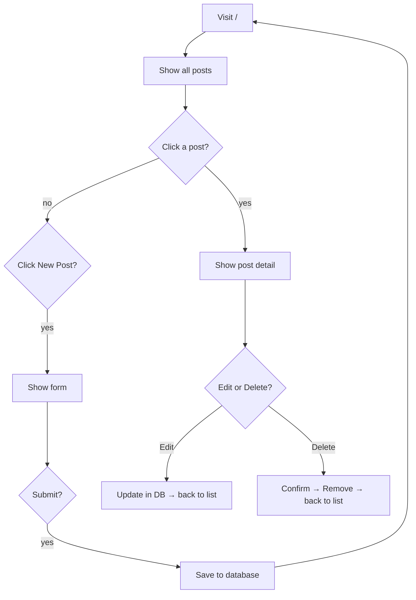

# Project 1 — Notice Board

> **ARCHIVE / REFERENCE ONLY** — Active syllabus is [curriculum-48](../curriculum-48/000_overview.md) (DRF + React). Hackathon cancelled.

## What We're Building

A notice board where anyone can:
- See all posts on the homepage
- Click to read a full post
- Write a new post
- Edit or delete their post

## App Pages

```
/                    → List of all posts
/post/<id>/          → Read one post
/new/                → Write a new post
/post/<id>/edit/     → Edit a post
/post/<id>/delete/   → Delete a post
```

## Flowchart



## Django Concepts This Project Covers

| Concept | Where |
|---------|-------|
| Model — database table | `models.py` |
| Migration — apply model to DB | terminal: `makemigrations`, `migrate` |
| Admin panel | `admin.py` |
| Class-Based Views (ListView, DetailView...) | `views.py` |
| URL patterns | `urls.py` |
| Templates (HTML with Django tags) | `templates/board/` |
| Forms + validation | `forms.py` |
| Tailwind CSS (styling) | `base.html` |

## File Overview

| File | What it does |
|------|-------------|
| `board/models.py` | `Post` table: title, content, dates |
| `board/admin.py` | Register Post in admin |
| `board/views.py` | Logic for each page |
| `board/urls.py` | URL → View mapping |
| `board/forms.py` | Post create/edit form |
| `templates/board/base.html` | Shared navbar + layout |
| `templates/board/post_list.html` | All posts |
| `templates/board/post_detail.html` | Single post |
| `templates/board/post_form.html` | Create + edit form |
| `templates/board/post_confirm_delete.html` | Delete confirmation |

## Answer Key

The complete working project is in the `noticeboard/` folder.
Compare your code if you get stuck.
