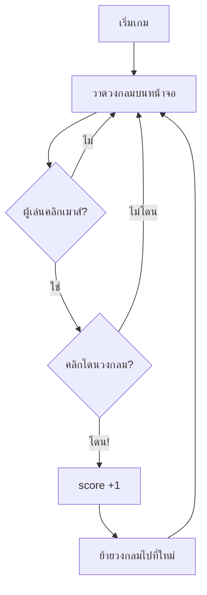

# 🎯 Click the Dot

## เป้าหมายของวันนี้
สร้างเกมคลิกวงกลม — **สั้นที่สุด** เล่นง่ายที่สุด ✨

## กฎของเกม
- วงกลมสีแดงโผล่ที่ตำแหน่งสุ่มบนหน้าจอ
- คลิกให้โดน = +1 คะแนน แล้วย้ายไปที่ใหม่
- ไม่มี Game Over — เล่นไปเรื่อยๆ

## Concepts ที่จะใช้

| Concept | ใช้ทำอะไร |
|---------|-----------|
| `if` | เช็คว่าคลิกโดนหรือเปล่า |
| `random` | สุ่มตำแหน่งใหม่ |
| `score` | นับคะแนน |
| `event` | รับ mouse click (ใหม่!) |

## ทำไมเกมนี้ง่ายกว่า?

```
Fruit Collector  → player เดิน + list + for loop + math.sqrt
Star Catcher     → star ตก + list + for loop + lives
Click the Dot    → แค่คลิก + random + if ✅
```

## แผนไฟล์ของวันนี้

```
002_window.py  → สร้างหน้าต่าง
003_dot.py     → วาดวงกลม random
004_click.py   → คลิกได้ + คะแนน
game.py        → เกมสมบูรณ์ (เฉลย)
```

## Flowchart


