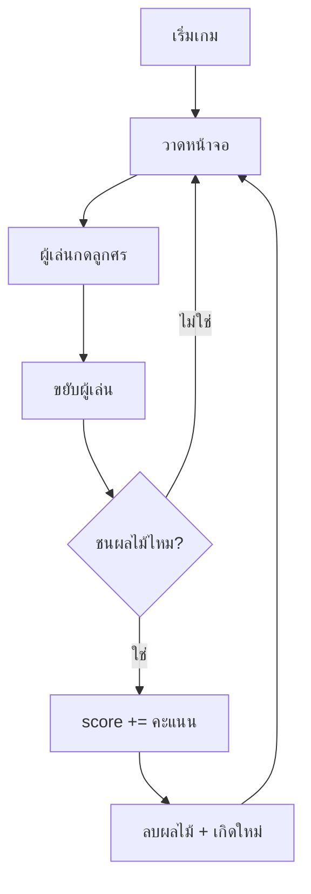

# 🍎 Fruit Collector

## เป้าหมายของวันนี้
สร้างเกมเก็บผลไม้ง่ายๆ ด้วย Python + Pygame ✨

## กฎของเกม
- ผู้เล่นเป็น **สี่เหลี่ยมสีน้ำเงิน** เดินได้ 4 ทิศทาง
- ผลไม้อยู่บนหน้าจอ — เดินไปชนเพื่อเก็บ
- เก็บผลไม้ได้ = +คะแนน
- ผลไม้หายไป แล้วเกิดใหม่ที่ตำแหน่งสุ่ม

## Concepts ที่จะใช้

| Concept | ใช้ทำอะไร |
|---------|-----------|
| `if` | เช็คว่าเก็บผลไม้ได้ไหม |
| `list` | เก็บผลไม้หลายๆ ลูก |
| `random` | สุ่มตำแหน่งผลไม้ |
| `score` | นับคะแนน |

## แผนไฟล์ของวันนี้

```
002_window.py       → สร้างหน้าต่างเกม
003_player.py       → ผู้เล่นเดินได้
004_fruit.py        → ผลไม้อยู่บนหน้าจอ
005_collect.py      → เก็บผลไม้ได้ + คะแนน
006_more_fruits.py  → ผลไม้หลายชนิด + คะแนนต่างกัน
008_bonus_timer.py  → โบนัส: จับเวลา 30 วินาที
game.py             → เกมสมบูรณ์ (เฉลย)
```

## Flowchart


