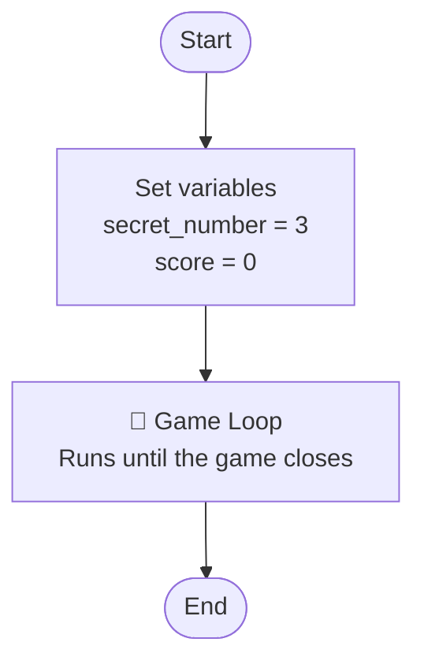
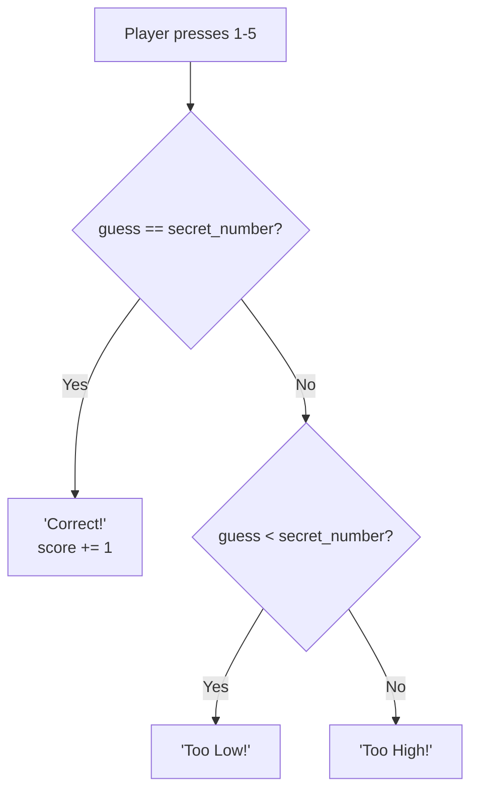

# What is a Flowchart?

Plan before you code — **like a map before a trip.**

---

## Symbols

| Shape | Meaning | Example |
|-------|---------|---------|
| ⬭ Oval | Start / End | Start, End |
| ▭ Rectangle | Do something | `score = 0` |
| ◇ Diamond | Ask a question → Yes / No | `guess == secret?` |

---

## Step 1 — Game Overview

Every game has 3 main parts:

---

## Step 2 — Inside the Game Loop

Every time the player presses a key, the game decides:

---

## Flowchart → Code

| Flowchart | Python |
|-----------|--------|
| ▭ `secret_number = 3` | `secret_number = 3` |
| ▭ Player presses a key | `if event.type == pygame.KEYDOWN` |
| ◇ `guess == secret?` | `if guess == secret_number:` |
| ◇ `guess < secret?` | `elif guess < secret_number:` |
| ▭ `"Too High!"` | `else:` |

---

## ✏️ Activity — Draw Your Own Flowchart

Draw on paper. Take 5 minutes.

**Check that you have:**
- [ ] Start / End
- [ ] ▭ Set secret_number and score
- [ ] ▭ Player presses a key
- [ ] ◇ guess == secret? → Yes / No
- [ ] ◇ guess < secret? → Yes / No
- [ ] ▭ Output for all 3 cases: Correct / Too Low / Too High

---

> **Rule**: Every new game → draw a Flowchart first.
