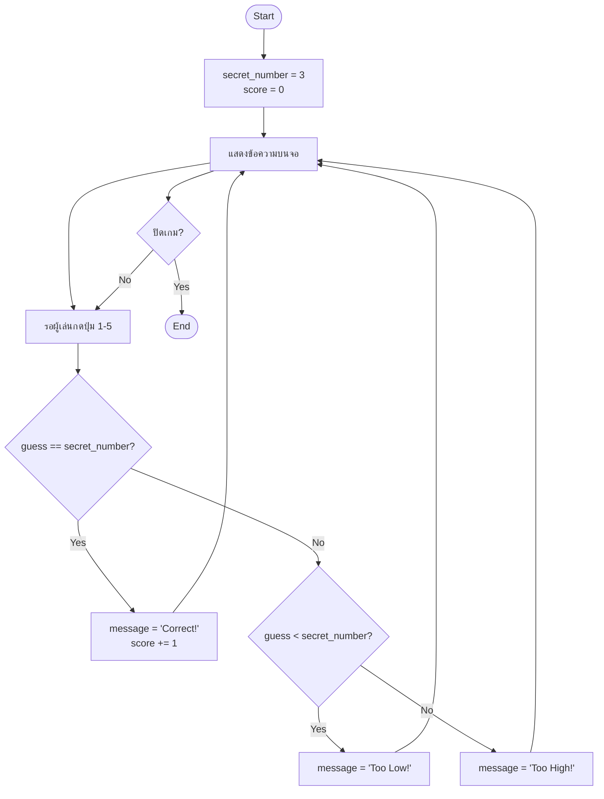

# Flowchart คืออะไร

ก่อนเขียนโค้ดทุกครั้ง — **คิดก่อนเขียน**

---

## ทำไมต้องวาด Flowchart?

```text
เดินทางไม่มีแผนที่  →  หลงทาง
เขียนโค้ดไม่มีแผน   →  โค้ดพัง ไม่รู้จะเขียนอะไร
```

Flowchart = **แผนที่ของโปรแกรม**

---

## สัญลักษณ์ที่ใช้

| สัญลักษณ์ | รูปร่าง | ความหมาย | ตัวอย่าง |
|----------|--------|----------|---------|
| วงรี | ⬭ | เริ่ม / จบ | Start, End |
| สี่เหลี่ยม | ▭ | คำสั่ง / กระทำ | `score = 0` |
| ข้าวหลามตัด | ◇ | ตัดสินใจ (ใช่/ไม่ใช่) | `guess == secret?` |
| ลูกศร | → | ทิศทาง | Yes / No |

---

## Flowchart ของ Guessing Game



---

## Flowchart → โค้ด

| Flowchart | Python |
|-----------|--------|
| ▭ `secret_number = 3` | `secret_number = 3` |
| ▭ รอผู้เล่นกดปุ่ม | `if event.type == pygame.KEYDOWN` |
| ◇ `guess == secret?` | `if guess == secret_number:` |
| ◇ `guess < secret?` | `elif guess < secret_number:` |
| ▭ `"Too High!"` | `else:` |

---

## ✏️ กิจกรรม — วาด Flowchart ด้วยตัวเอง

วาดบนกระดาษ ใช้เวลา 5 นาที

**ตรวจสอบว่าครบ:**
- [ ] Start / End
- [ ] ตั้งค่าตัวแปรตอนเริ่ม (secret_number, score)
- [ ] รับ Input (ผู้เล่นกดปุ่ม)
- [ ] ◇ ตรวจ `guess == secret` → Yes/No
- [ ] ◇ ตรวจ `guess < secret` → Yes/No
- [ ] Output ทั้ง 3 กรณี (Correct / Too Low / Too High)

---

> 🔑 **กฎ**: ทุกเกมที่สร้าง → วาด Flowchart ก่อนเสมอ
