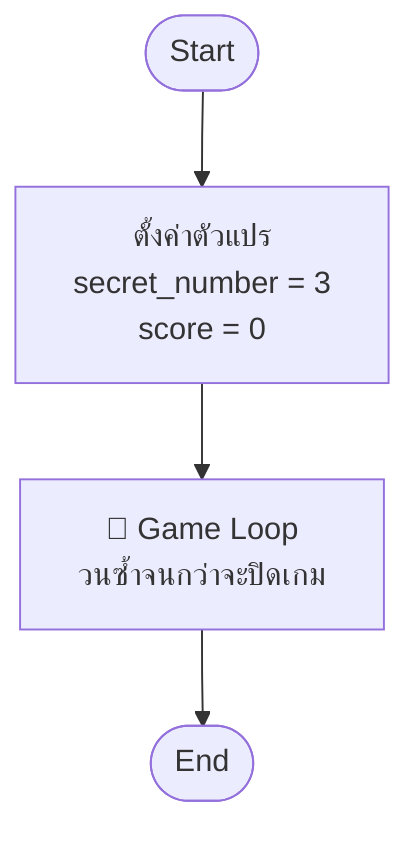
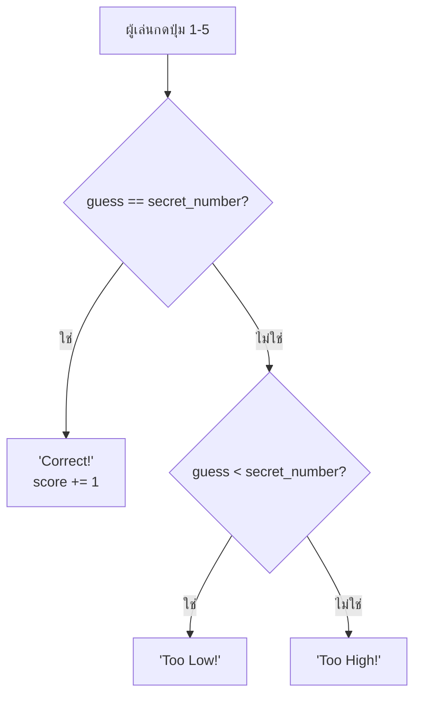

# Flowchart คืออะไร

วาดแผนก่อนเขียนโค้ด — **เหมือนแผนที่ก่อนออกเดินทาง**

---

## สัญลักษณ์

| รูปร่าง | ความหมาย | ตัวอย่าง |
|--------|----------|---------|
| ⬭ วงรี | เริ่ม / จบ | Start, End |
| ▭ สี่เหลี่ยม | ทำอะไรบางอย่าง | `score = 0` |
| ◇ ข้าวหลามตัด | ถามคำถาม → ใช่ / ไม่ใช่ | `guess == secret?` |

---

## ขั้นที่ 1 — ภาพรวมเกม

เกมแบ่งเป็น 3 ส่วนใหญ่ๆ:

---

## ขั้นที่ 2 — ข้างใน Game Loop

ทุกครั้งที่ผู้เล่นกดปุ่ม เกมจะตัดสินใจแบบนี้:

---

## Flowchart → โค้ด

| Flowchart | Python |
|-----------|--------|
| ▭ `secret_number = 3` | `secret_number = 3` |
| ▭ ผู้เล่นกดปุ่ม | `if event.type == pygame.KEYDOWN` |
| ◇ `guess == secret?` | `if guess == secret_number:` |
| ◇ `guess < secret?` | `elif guess < secret_number:` |
| ▭ `"Too High!"` | `else:` |

---

## ✏️ กิจกรรม — วาด Flowchart ด้วยตัวเอง

วาดบนกระดาษ ใช้เวลา 5 นาที

**ตรวจสอบว่าครบ:**
- [ ] Start / End
- [ ] ▭ ตั้งค่า secret_number และ score
- [ ] ▭ ผู้เล่นกดปุ่ม
- [ ] ◇ guess == secret? → ใช่ / ไม่ใช่
- [ ] ◇ guess < secret? → ใช่ / ไม่ใช่
- [ ] ▭ Output 3 กรณี: Correct / Too Low / Too High

---

> **กฎ**: ทุกเกมที่สร้าง → วาด Flowchart ก่อนเสมอ
