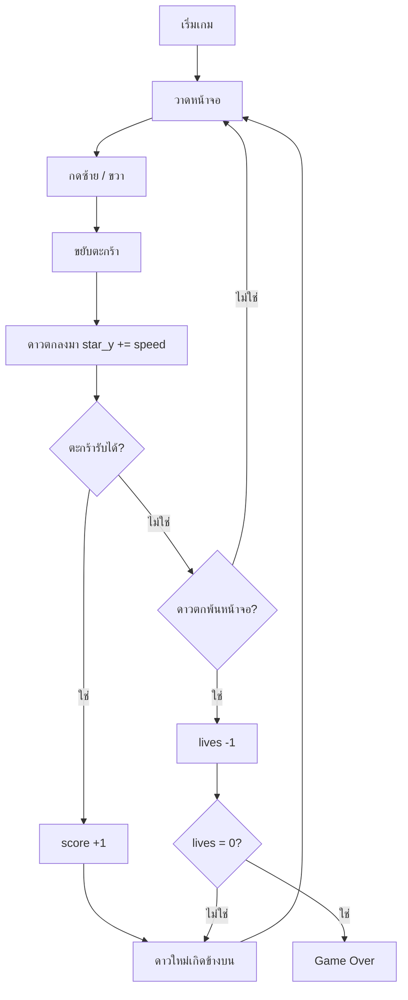

# ⭐ Star Catcher

## เป้าหมายของวันนี้
สร้างเกมรับดาวตกง่ายๆ ด้วย Python + Pygame ✨

## กฎของเกม
- ผู้เล่นเป็น **ตะกร้า** เลื่อนซ้าย-ขวาได้
- **ดาว** ตกลงมาจากด้านบนแบบสุ่ม
- รับดาวได้ = +1 คะแนน
- พลาดดาว = -1 ชีวิต (เริ่มที่ 3 ชีวิต)
- ชีวิตหมด = Game Over

## Concepts ที่จะใช้

| Concept | ใช้ทำอะไร |
|---------|-----------|
| `if` | เช็คว่าจับดาวได้หรือพลาด |
| `list` | เก็บดาวหลายดวงพร้อมกัน |
| `random` | สุ่มตำแหน่ง x และความเร็วดาว |
| `score` | นับคะแนน |

## แผนไฟล์ของวันนี้

```
002_window.py     → สร้างหน้าต่างเกม
003_basket.py     → ตะกร้าเลื่อนได้
004_star.py       → ดาวตกลงมา
005_catch.py      → จับดาวได้ + คะแนน + ชีวิต
006_many_stars.py → ดาวหลายดวง + ความเร็ว random
game.py           → เกมสมบูรณ์ (เฉลย)
```

## Flowchart


