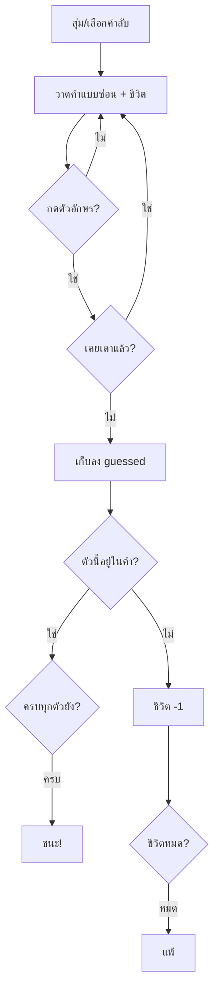

# Week 9 — Word Guess Game 🔤

## วันนี้จะสร้างอะไร

**Word Hunter** — เกมทายคำภาษาอังกฤษ กดตัวอักษรบนคีย์บอร์ดเพื่อเดา

```text
┌────────────────────────────────────────┐
│  WORD HUNTER                 ชีวิต ♥♥♥ │
│                                        │
│  คำใบ้ : สัตว์เลี้ยงที่ชอบเห่า           │
│                                        │
│         D  _  G                        │
│                                        │
│  ตัวที่เดาไปแล้ว : A  D  G  S           │
│                                        │
│  กดตัวอักษร A-Z เพื่อเดา                │
└────────────────────────────────────────┘
```

---

## Recap จากเดือน 2

| โค้ด | ความหมาย |
|------|----------|
| game loop + `flip()` | โครงเกม Pygame |
| `KEYDOWN` | จับปุ่มที่กด |
| `render` + `blit` | วาดตัวหนังสือ |
| state (`finished`) | สถานะเกม |
| `list` | เก็บข้อมูลหลายตัว |

---

## ของใหม่วันนี้ — เรื่องของ String 🧵

| ของใหม่ | ทำอะไร |
|---------|--------|
| `for ch in word:` | วนดูตัวอักษรทีละตัวในคำ |
| `"A" in word` | เช็กว่ามีตัวอักษรนี้ในคำไหม |
| `pygame.key.name(event.key)` | แปลงปุ่มที่กดเป็นตัวอักษร |
| `.upper()` | เปลี่ยนเป็นตัวพิมพ์ใหญ่ |
| `list` เก็บตัวที่เดาไปแล้ว | `guessed.append("A")` |

---

## หัวใจของเกมนี้ 🧠

```text
คำลับ    : D O G
เดาไปแล้ว : A, D, S

วาดทีละตัว:
  D อยู่ใน guessed?  ใช่  → วาด "D"
  O อยู่ใน guessed?  ไม่   → วาด "_"
  G อยู่ใน guessed?  ไม่   → วาด "_"

ได้ผลลัพธ์: D _ _
```

> ไม่ต้องแก้ตัวคำลับเลย — แค่ **เลือกว่าจะวาดอะไร** ตอนแสดงผล

---

## Flowchart



---

## ไฟล์วันนี้

```
002_word.py    → แสดงคำลับแบบซ่อน _ _ _
003_letter.py  → กดตัวอักษรเพื่อเดา
004_lives.py   → ชีวิต + ชนะ/แพ้
game.py        → เฉลย
```

> เด็กสร้างไฟล์ `word.py` ของตัวเอง
