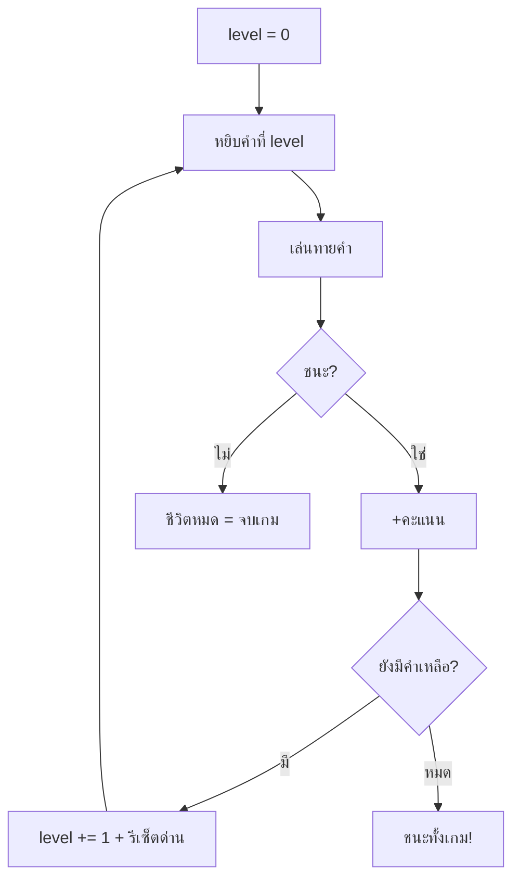

# Week 10 — Lists in Games 📚

## วันนี้จะสร้างอะไร

Word Hunter ที่มี **คลังคำหลายคำ** — เล่นจบคำหนึ่งไปคำถัดไปเรื่อยๆ พร้อมเก็บคะแนน

```text
┌────────────────────────────────────────┐
│  WORD HUNTER          ด่าน 2/5  ●●●●●● │
│  คะแนน 24                              │
│                                        │
│  [ สัตว์ ]  ตัวใหญ่ มีงวงยาว            │
│                                        │
│       E  L  E  _  H  A  N  T           │
│                                        │
│  เดาไปแล้ว : A E H L N S T             │
└────────────────────────────────────────┘
```

---

## Recap จาก Week 9

| โค้ด | ความหมาย |
|------|----------|
| `for ch in word:` | วนดูตัวอักษร |
| `letter in word` | เช็กว่ามีในคำ |
| `guessed.append()` | เพิ่มเข้า list |
| `lives -= 1` | เสียชีวิต |

---

## ของใหม่วันนี้

| ของใหม่ | ทำอะไร |
|---------|--------|
| คลังคำแบบ list ซ้อน list | `[[คำ, ใบ้, หมวด], ...]` |
| `level` (index ของด่าน) | ตอนนี้เล่นคำที่เท่าไร |
| `level += 1` | ไปคำถัดไป |
| `len(words)` | มีกี่คำทั้งหมด |
| คะแนนตามชีวิตที่เหลือ | ยิ่งเดาแม่นยิ่งได้เยอะ |

> โครงสร้างข้อมูลเหมือน `questions` ใน Quiz Arena เป๊ะ! แค่เปลี่ยนเนื้อหา 🧩

---

## Flowchart



---

## ไฟล์วันนี้

```
002_wordbank.py  → คลังคำ + หมวดหมู่
003_levels.py    → เล่นหลายด่านต่อกัน
004_score.py     → คะแนนตามชีวิตที่เหลือ
game.py          → เฉลย
```

> เริ่มจาก `game.py` ของ Week 9
