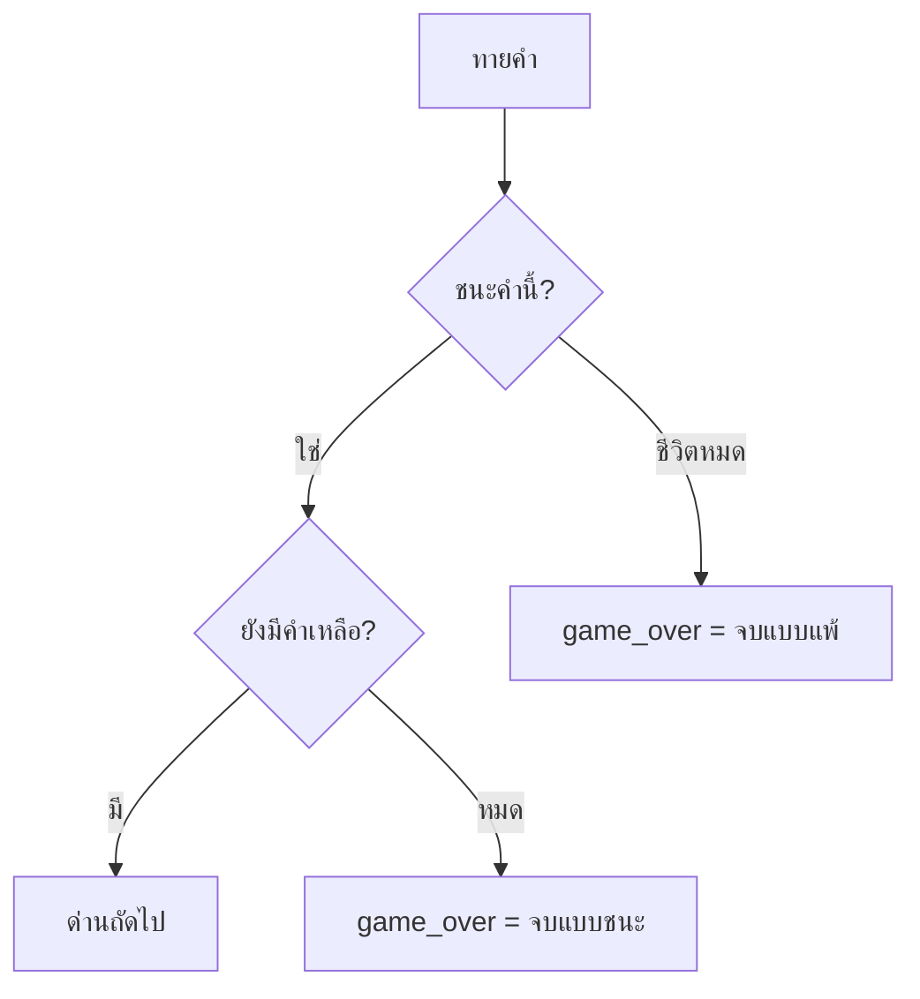

# 2) เล่นหลายด่านต่อกัน

## เป้าหมาย
ทายคำถูก → กด Space → ไปคำถัดไป

---

## แนวคิด — รีเซ็ตอะไรบ้างเมื่อขึ้นด่านใหม่?

```python
level += 1          # ไปคำถัดไป
guessed = []        # ล้างตัวอักษรที่เดา  ← ต้องล้าง!
lives = MAX_LIVES   # ชีวิตเต็มใหม่       ← แล้วแต่กติกา
stage_over = False  # ด่านยังไม่จบ
```

| ตัวแปร | รีเซ็ตไหม | เพราะ |
|--------|-----------|-------|
| `guessed` | ✅ ล้าง | ไม่งั้นคำใหม่เปิดเอง |
| `lives` | ✅ เติมเต็ม | ให้โอกาสใหม่ |
| `level` | ❌ +1 | เดินหน้า |
| `score` | ❌ เก็บไว้ | สะสมทั้งเกม |

> **บั๊กคลาสสิก**: ลืมล้าง `guessed` → คำใหม่โผล่มาเปิดเผยครึ่งคำแล้ว 😂

---

## แนวคิด — 2 ระดับของการจบ

```python
stage_over = False    # จบ "ด่านนี้" (ชนะหรือแพ้คำนี้)
game_over  = False    # จบ "ทั้งเกม" (ชีวิตหมด หรือ เล่นครบทุกคำ)
```



---

## แนวคิด — กด Space ไปด่านถัดไป

```python
if stage_over and not game_over:
    if event.key == pygame.K_SPACE:
        level += 1
        if level >= len(words):
            game_over = True          # เล่นครบทุกคำแล้ว
        else:
            guessed = []
            lives = MAX_LIVES
            stage_over = False
```

> เหมือน Quiz Arena ตอนกด Space ไปข้อถัดไปเลย — **แนวคิดเดิม ใช้ซ้ำได้ตลอด** ♻️

---

## 📝 แก้ `game.py`

1. เพิ่ม `stage_over` แยกจาก `game_over`
2. เช็กจบด่าน: `if win or lives <= 0: stage_over = True`
3. ถ้า `lives <= 0` ให้ `game_over = True` ด้วย (แพ้ทั้งเกม)
4. เพิ่มการกด Space ไปด่านถัดไป
5. วาด `f"ด่าน {level + 1}/{len(words)}"` มุมบน

---

> รันดู — ทายคำแรกถูก กด Space ต้องได้คำใหม่ + ชีวิตเต็ม + ตัวที่เดาถูกล้างหมด ✅
