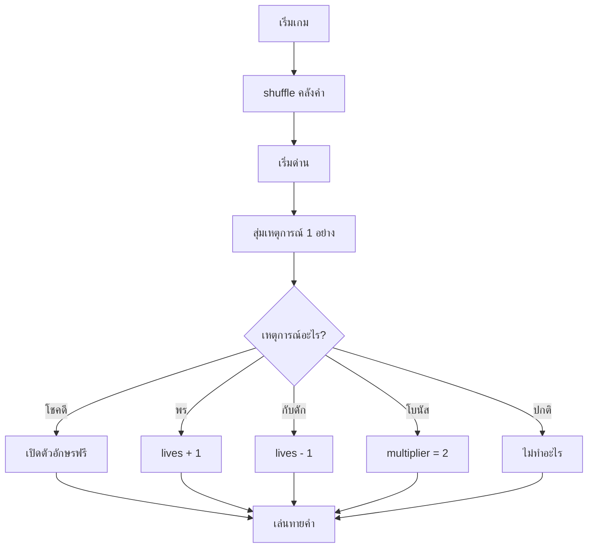

# Week 11 — Random Events 🎲

## วันนี้จะสร้างอะไร

Word Hunter ที่ **เล่นไม่ซ้ำเดิม** — คำสุ่ม + เหตุการณ์เซอร์ไพรส์ทุกด่าน

```text
┌────────────────────────────────────────┐
│  WORD HUNTER          ด่าน 2/5         │
│  ✨ เหตุการณ์: โชคดี! เปิดให้ 1 ตัวฟรี   │
│                                        │
│  [ ธรรมชาติ ]  เกิดหลังฝนตก มี 7 สี      │
│                                        │
│       R  _  _  _  _  _  _              │
└────────────────────────────────────────┘

เหตุการณ์ที่เป็นไปได้
  ✨ โชคดี   : เปิดตัวอักษรให้ฟรี 1 ตัว
  ❤️ พร      : ชีวิตเพิ่ม 1
  💀 กับดัก  : ชีวิตลด 1
  ⭐ โบนัส   : ด่านนี้คะแนนคูณ 2
  😐 ปกติ    : ไม่มีอะไรเกิดขึ้น
```

---

## Recap

| โค้ด | ความหมาย |
|------|----------|
| `random.randint(a, b)` | สุ่มเลข (Week 2) |
| `random.shuffle(list)` | สลับลำดับ (Week 8) |
| `words[level][0]` | หยิบคำจากคลัง (Week 10) |

---

## ของใหม่วันนี้

| ของใหม่ | ทำอะไร |
|---------|--------|
| `random.choice(list)` | สุ่มหยิบ 1 ตัวจาก list |
| `random.random()` | สุ่มทศนิยม 0.0 - 1.0 (ใช้ทำ % โอกาส) |
| ตาราง event | เก็บเหตุการณ์ไว้ใน list แล้วสุ่ม |
| `multiplier` | ตัวคูณคะแนน |

---

## ทำไมเกมต้องมีความสุ่ม? 🎲

| ไม่มีสุ่ม | มีสุ่ม |
|-----------|--------|
| เล่นซ้ำได้คำเดิม ลำดับเดิม | ทุกรอบไม่เหมือนกัน |
| เล่นรอบเดียวก็พอ | อยากเล่นอีก |
| จำคำตอบได้ | ต้องใช้ทักษะจริง |

> เกมดังทุกเกม (Roblox, Minecraft, เกมกาชา) ใช้ความสุ่มทั้งนั้น

---

## Flowchart



---

## ไฟล์วันนี้

```
002_choice.py   → สุ่มคำจากคลัง
003_events.py   → ตารางเหตุการณ์ + สุ่มเหตุการณ์
004_effects.py  → ทำให้เหตุการณ์มีผลจริง
game.py         → เฉลย
```

> เริ่มจาก `game.py` ของ Week 10
