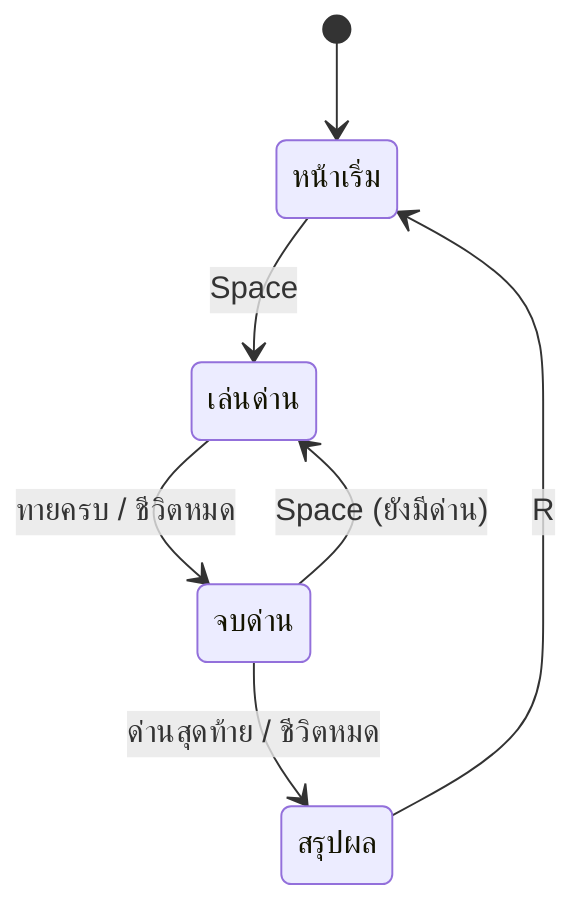

# Week 12 — Mini Game 🏆

## วันนี้จะสร้างอะไร

**WORD HUNTER v1.0** — รวมทุกอย่างที่เรียนมา 12 สัปดาห์เป็นเกมสมบูรณ์ 1 เกม

```text
        ╔══════════════════════════════╗
        ║      WORD HUNTER v1.0        ║
        ║                              ║
        ║   ทายคำจากคำใบ้ 6 ด่าน        ║
        ║   ระวังกับดัก เก็บโบนัส!       ║
        ║                              ║
        ║     กด Space เพื่อเริ่ม        ║
        ║                              ║
        ║      สถิติสูงสุด : 128        ║
        ╚══════════════════════════════╝
```

---

## สิ่งที่เกมนี้มี (มาจากสัปดาห์ไหนบ้าง)

| ระบบ | มาจาก |
|------|-------|
| Input → Process → Output | W1 |
| เงื่อนไข if/elif/else | W2 |
| คะแนนสะสม | W3 |
| game loop | W4 |
| หน้าต่าง Pygame + ฟอนต์ไทย | W5 |
| feedback ด้วยสี | W6 |
| state ของเกม | W6 |
| แถบเวลา / progress bar | W7 |
| หน้าเริ่มเกม + high score | W8 |
| string logic + ระบบชีวิต | W9 |
| คลังคำ + หลายด่าน | W10 |
| เหตุการณ์สุ่ม + ตัวคูณ | W11 |

> **12 สัปดาห์ = 1 เกมที่เล่นได้จริง** 🎮

---

## ของใหม่วันนี้ (นิดเดียว)

| ของใหม่ | ทำอะไร |
|---------|--------|
| แป้นตัวอักษร A-Z บนจอ | ผู้เล่นเห็นว่าเดาอะไรไปแล้ว |
| แถบความคืบหน้าด่าน | รู้ว่าเหลืออีกกี่ด่าน |
| high score ข้ามรอบ | เก็บสถิติสูงสุด |

---

## แผน state ทั้งเกม



---

## ไฟล์วันนี้

```
002_menu.py      → หน้าเริ่มเกม + high score
003_keyboard.py  → แป้นตัวอักษร A-Z บนจอ
004_challenge.md → โจทย์ท้าทาย (ทำเองต่อ)
game.py          → WORD HUNTER v1.0 (เฉลย)
```
