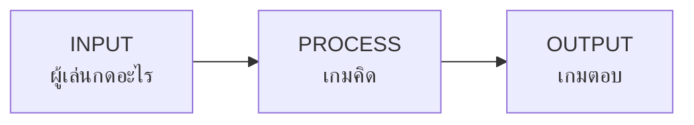

# Week 1 — Game Logic Basics 🎮

## วันนี้จะสร้างอะไร

**Number Quest ตอนที่ 1: สร้างฮีโร่** — เกมข้อความที่ถามชื่อ ถามอาชีพ แล้วสร้างฮีโร่ให้เรา

```
==============================
   NUMBER QUEST - CREATE HERO
==============================
ชื่อฮีโร่ของเธอ: Mint

เลือกอาชีพ
  1) นักดาบ
  2) นักธนู
  3) นักเวทย์
พิมพ์เลข 1-3: 3

------------------------------
  ฮีโร่: Mint
  อาชีพ: นักเวทย์
  พลังโจมตี: 12
  พลังชีวิต: 80
------------------------------
```

---

## หัวใจของทุกเกม — Input → Process → Output



| ขั้น | ในเกมนี้ | ในเกม Flappy Bird |
|------|----------|-------------------|
| **Input** | พิมพ์ชื่อ / เลือกเลข | กด Space |
| **Process** | เลือกค่าพลังตามอาชีพ | คำนวณแรงโน้มถ่วง |
| **Output** | แสดงการ์ดฮีโร่ | วาดนกที่ตำแหน่งใหม่ |

> **ทุกเกมในโลกนี้คือ 3 อย่างนี้วนซ้ำ** ตั้งแต่ Roblox ยัน ROV

---

## เป้าหมายวันนี้

1. ใช้ `print()` แสดงผล (Output)
2. ใช้ `input()` รับข้อมูล (Input)
3. ใช้ `if / elif / else` ตัดสินใจ (Process)
4. รวมเป็นเกมที่เล่นได้

---

## ไฟล์ในโฟลเดอร์นี้

| ไฟล์ | ใช้ทำอะไร |
|------|-----------|
| `00X_....md` | **สไลด์** — เปิดให้เด็กดู แล้วพิมพ์ตาม |
| `00X_....py` | **เช็คพอยต์** — โค้ด ณ จุดนั้น (ครูใช้เทียบ) |
| `game.py` | **เฉลย** — เกมสมบูรณ์ |

> เด็กสร้างไฟล์ `hero.py` ของตัวเอง แล้วพิมพ์ตามสไลด์
