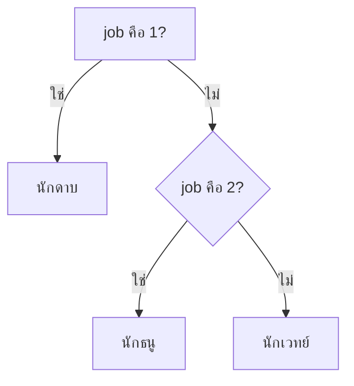

# 3) PROCESS — ให้เกมคิด

## เป้าหมาย
ผู้เล่นเลือกอาชีพ 1-3 → เกมกำหนดค่าพลังให้

---

## แนวคิด 1 — `int()` แปลงข้อความเป็นตัวเลข

`input()` ให้ผลเป็น **ข้อความเสมอ** แม้ผู้เล่นจะพิมพ์เลข

```python
job = input("พิมพ์เลข 1-3: ")     # job = "3"  ← ข้อความ!
job = int(job)                    # job = 3    ← ตัวเลขจริง
```

เขียนสั้นๆ ได้เป็น

```python
job = int(input("พิมพ์เลข 1-3: "))
```

| ค่า | ชนิด | บวกได้ไหม |
|-----|------|-----------|
| `"3"` | ข้อความ (str) | `"3" + "3"` = `"33"` 😵 |
| `3` | ตัวเลข (int) | `3 + 3` = `6` ✅ |

---

## แนวคิด 2 — `if / elif / else` ตัดสินใจ

```python
if job == 1:
    print("นักดาบ")
elif job == 2:
    print("นักธนู")
else:
    print("นักเวทย์")
```



> **ระวัง** `=` คือ *ใส่ค่า* / `==` คือ *เปรียบเทียบ*
> และบรรทัดใต้ `if` ต้อง **เว้นวรรค 4 ช่อง** (indent) เสมอ

---

## 📝 เพิ่มใน `hero.py`

```python
print("เลือกอาชีพ")
print("  1) นักดาบ")
print("  2) นักธนู")
print("  3) นักเวทย์")
job = int(input("พิมพ์เลข 1-3: "))

if job == 1:
    job_name = "นักดาบ"
    attack = 10
    hp = 100
elif job == 2:
    job_name = "นักธนู"
    attack = 8
    hp = 90
else:
    job_name = "นักเวทย์"
    attack = 12
    hp = 80
```

---

> รันดู — ตอนนี้ยังไม่เห็นอะไรเปลี่ยน เพราะเรายัง **ไม่ได้ print ผลลัพธ์** → ทำต่อในสไลด์หน้า
