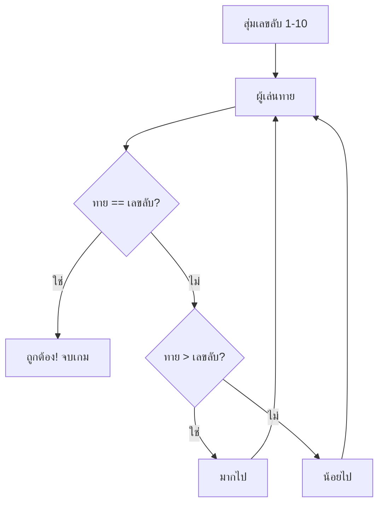

# Week 2 — Guess the Number 🔢

## วันนี้จะสร้างอะไร

**เกมทายเลข** — คอมพิวเตอร์แอบคิดเลข 1-10 เรามี **3 ครั้ง** ในการทาย

```
=== GUESS THE NUMBER ===
ฉันแอบคิดเลข 1 ถึง 10 ไว้...
เธอมี 3 ครั้ง!

ครั้งที่ 1 - ทายเลข: 5
มากไป! ลองต่ำกว่านี้

ครั้งที่ 2 - ทายเลข: 3
น้อยไป! ลองสูงกว่านี้

ครั้งที่ 3 - ทายเลข: 4
ถูกต้อง! เก่งมาก
```

---

## Recap จาก Week 1

| โค้ด | ความหมาย |
|------|----------|
| `input()` | รับจากผู้เล่น |
| `int(...)` | แปลงข้อความ → ตัวเลข |
| `if / elif / else` | ตัดสินใจ |
| `f"{name}"` | แทรกตัวแปรในข้อความ |

---

## ของใหม่วันนี้

| ของใหม่ | ทำอะไร |
|---------|--------|
| `import random` | เรียกใช้ความสามารถ "สุ่ม" |
| `random.randint(1, 10)` | สุ่มเลข 1-10 |
| `>` `<` `==` | เปรียบเทียบตัวเลข |

---

## Flowchart



---

## ไฟล์วันนี้

```
002_random.py       → สุ่มเลขลับ
003_compare.py      → ทาย 1 ครั้ง + บอกใบ้
004_three_tries.py  → ทายได้ 3 ครั้ง
game.py             → เฉลย
```

> เด็กสร้างไฟล์ `guess.py` ของตัวเอง แล้วพิมพ์ตามสไลด์
