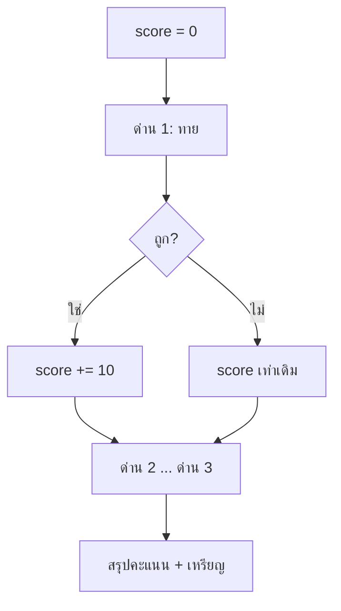

# Week 3 — Score System 🏅

## วันนี้จะสร้างอะไร

**Number Quest: Score Mode** — เล่น 3 ด่าน เก็บคะแนน แล้วรับเหรียญตอนจบ

```
=== NUMBER QUEST : SCORE MODE ===
คะแนนเริ่มต้น: 0

[ ด่าน 1 ] ทายเลข 1-5: 3
ถูกต้อง! +10   คะแนนตอนนี้ = 10

[ ด่าน 2 ] ทายเลข 1-5: 1
ผิด! เลขคือ 4   คะแนนตอนนี้ = 10

[ ด่าน 3 ] ทายเลข 1-5: 5
ถูกต้อง! +10   คะแนนตอนนี้ = 20

------------------------------
  คะแนนรวม : 20 / 30
  ตอบถูก   : 2 / 3 ด่าน
  เหรียญ   : SILVER
------------------------------
```

---

## Recap จาก Week 2

| โค้ด | ความหมาย |
|------|----------|
| `random.randint(1, 10)` | สุ่มเลข |
| `if / elif / else` | ตัดสินใจ |
| `won = True` | ตัวแปรจำสถานะ |

---

## ของใหม่วันนี้

| ของใหม่ | ทำอะไร |
|---------|--------|
| `score = 0` | ตัวแปร **สะสม** |
| `score += 10` | บวกเพิ่มเข้าไปในตัวเดิม |
| `correct += 1` | ตัวนับ (counter) |
| จัดอันดับด้วย `if` | แปลงคะแนน → เหรียญ |

---

## Flowchart



---

## ไฟล์วันนี้

```
002_score_var.py  → รู้จัก score += 
003_rounds.py     → เล่น 3 ด่าน เก็บคะแนน
004_rank.py       → สรุปคะแนน + เหรียญ
game.py           → เฉลย
```

> เด็กสร้างไฟล์ `score.py` ของตัวเอง
