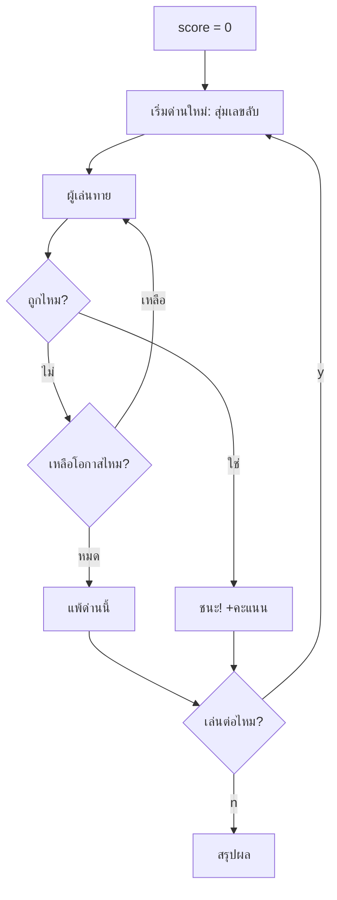

# Week 4 — Game Loop 🔁

## วันนี้จะสร้างอะไร

**Number Quest ฉบับสมบูรณ์** — เกมทายเลขที่เล่นกี่รอบก็ได้ ไม่ต้อง copy โค้ดอีกต่อไป!

```
============================
     NUMBER QUEST v1.0
============================

[ ด่าน 1 ]  ทายเลข 1-20
  ครั้งที่ 1: 10  -> มากไป
  ครั้งที่ 2: 5   -> น้อยไป
  ครั้งที่ 3: 7   -> ถูกต้อง! +8 คะแนน

เล่นด่านต่อไปไหม? (y/n): y

[ ด่าน 2 ]  ทายเลข 1-20
  ...

เล่นด่านต่อไปไหม? (y/n): n

----------------------------
  ด่านที่เล่น : 2
  ชนะ        : 2
  คะแนนรวม   : 15
  เหรียญ     : SILVER
----------------------------
```

---

## ปัญหาที่เจอ 2 สัปดาห์ที่ผ่านมา 😩

```python
# Week 2                    # Week 3
# ---- ครั้งที่ 1 ----      # ---- ด่าน 1 ----
# ---- ครั้งที่ 2 ----      # ---- ด่าน 2 ----   ← copy!
# ---- ครั้งที่ 3 ----      # ---- ด่าน 3 ----   ← copy!
```

> **วันนี้เราจะฆ่าการ copy ทิ้งให้หมด** ด้วย `while` 🔪

---

## ของใหม่วันนี้

| ของใหม่ | ทำอะไร |
|---------|--------|
| `while เงื่อนไข:` | วนซ้ำตราบใดที่เงื่อนไขยังจริง |
| `break` | ออกจากลูปทันที |
| loop ซ้อน loop | ลูปด่าน ครอบ ลูปการทาย |

---

## Flowchart



---

## ไฟล์วันนี้

```
002_while.py       → รู้จัก while
003_guess_loop.py  → ทายจนกว่าจะถูก
004_replay.py      → เล่นหลายด่าน
game.py            → Number Quest ฉบับสมบูรณ์ (เฉลย)
```

> เด็กสร้างไฟล์ `quest.py` ของตัวเอง
