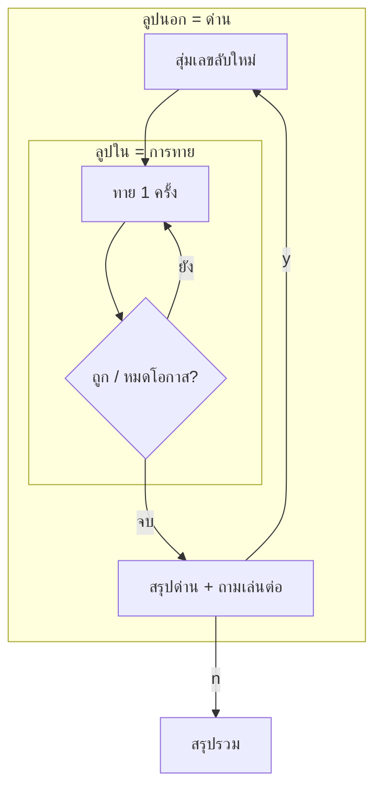

# 3) เล่นหลายด่าน — ลูปซ้อนลูป

## เป้าหมาย
จบด่านแล้วถามว่า "เล่นต่อไหม?" ตอบ y = ด่านใหม่

---

## แนวคิด — ลูปนอก ครอบ ลูปใน



```python
playing = True
while playing:              # ← ลูปนอก : ด่าน
    ...
    while tries < 3:        # ← ลูปใน  : การทาย
        ...
    answer = input("เล่นด่านต่อไปไหม? (y/n): ")
    if answer != "y":
        playing = False     # ← ทำให้ลูปนอกจบ
```

> **สำคัญ** ของที่ต้องรีเซ็ตทุกด่าน (secret, tries, won) ต้องอยู่ **ในลูปนอก**
> ของที่สะสมทั้งเกม (score, rounds) ต้องอยู่ **นอกลูป**

---

## วางตัวแปรให้ถูกที่ 📦

```python
score = 0        # ← นอกลูป : สะสมทั้งเกม
rounds = 0       # ← นอกลูป
wins = 0         # ← นอกลูป

while playing:
    secret = random.randint(1, 20)   # ← ในลูป : ใหม่ทุกด่าน
    tries = 0                        # ← ในลูป
    won = False                      # ← ในลูป
```

> ถ้าเอา `score = 0` ไปไว้ในลูป → คะแนนโดนล้างทุกด่าน (บั๊กยอดฮิต!)

---

## คิดคะแนนแบบมีชั้นเชิง

ทายน้อยครั้ง = ได้คะแนนเยอะ

```python
if won:
    points = 10 - (tries - 1) * 2     # ครั้งแรก 10 / ครั้งสอง 8 / ครั้งสาม 6
    score += points
    wins += 1
```

---

## 📝 เพิ่มใน `quest.py`

ครอบโค้ดด่านทั้งหมดด้วย `while playing:` แล้วเพิ่มตัวแปรสะสม
(ดูโครงเต็มใน `004_replay.py` หรือ `game.py`)

```python
answer = input("เล่นด่านต่อไปไหม? (y/n): ")
if answer != "y":
    playing = False
```

---

> รันดู — ตอบ y ต้องได้ด่านใหม่ + เลขลับใหม่ / ตอบ n ต้องจบเกม ✅
