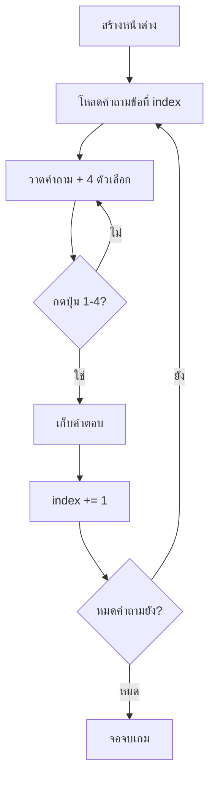

# Week 5 — Quiz Arena (Basic) ❓

## วันนี้จะสร้างอะไร

เกมตอบคำถามใน **หน้าต่าง Pygame** จริงๆ — กดเลข 1-4 เพื่อเลือกคำตอบ

```text
┌──────────────────────────────────────┐
│  QUIZ ARENA                 ข้อ 1/4  │
│                                      │
│   2 + 3 เท่ากับเท่าไร?                │
│                                      │
│   ┌────────────────────────────┐     │
│   │ 1)  4                      │     │
│   ├────────────────────────────┤     │
│   │ 2)  5                      │     │
│   ├────────────────────────────┤     │
│   │ 3)  6                      │     │
│   ├────────────────────────────┤     │
│   │ 4)  7                      │     │
│   └────────────────────────────┘     │
│                                      │
│  กด 1-4 เพื่อตอบ                      │
└──────────────────────────────────────┘
```

---

## เดือนที่แล้วเทียบเดือนนี้

| | เดือน 1 (Console) | เดือน 2 (Pygame) |
|---|---|---|
| หน้าจอ | ตัวหนังสือดำ-ขาว | หน้าต่างมีสี |
| Input | `input()` แล้วรอ | กดปุ่ม เกมไม่หยุด |
| Loop | `while playing:` | `while running:` (game loop) |
| Output | `print()` | `screen.blit()` แล้ว `flip()` |

> **แนวคิดเดิมทั้งหมด** — แค่เปลี่ยนหน้าจอ!

---

## ของใหม่วันนี้

| ของใหม่ | ทำอะไร |
|---------|--------|
| `pygame.init()` | เปิดระบบเกม |
| `pygame.display.set_mode((800, 600))` | สร้างหน้าต่าง |
| `font.render(...)` + `screen.blit(...)` | วาดตัวหนังสือ |
| `pygame.draw.rect(...)` | วาดกล่องตัวเลือก |
| `event.type == pygame.KEYDOWN` | จับปุ่มที่กด |
| `list` ซ้อน `list` | เก็บคำถาม + ตัวเลือก |

---

## เตรียมเครื่องก่อนเริ่ม

```bash
pip install pygame
python -c "import pygame; print(pygame.version.ver)"
```

> ถ้าเห็นเลขเวอร์ชัน = พร้อมเล่นแล้ว ✅

---

## Flowchart



---

## ไฟล์วันนี้

```
002_window.py     → หน้าต่าง + ตัวหนังสือไทย
003_questions.py  → คลังคำถาม + แสดงข้อแรก
004_answer.py     → กด 1-4 ตอบ + ไปข้อถัดไป
quiz.py           → เฉลย
```

> เด็กสร้างไฟล์ `quiz.py` ของตัวเอง
