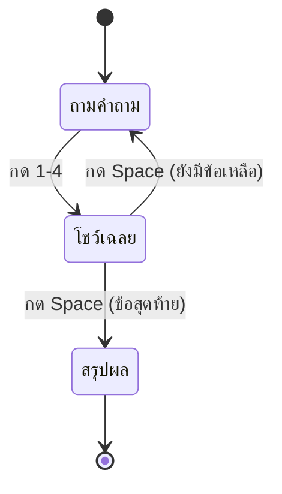

# Week 6 — Quiz Feedback ✅❌

## วันนี้จะสร้างอะไร

Quiz Arena ที่ **บอกได้ว่าตอบถูกหรือผิด** + เก็บคะแนน + สรุปผลตอนจบ

```text
ตอบถูก                          ตอบผิด
┌───────────────────────┐       ┌───────────────────────┐
│  ✓ ถูกต้อง! +10       │       │  ✗ ผิด!               │
│                       │       │  คำตอบที่ถูกคือ ข้อ 3 │
│  [กรอบเขียวรอบข้อ 2]  │       │  [กรอบแดงข้อที่เลือก] │
│                       │       │  [กรอบเขียวข้อที่ถูก] │
│  กด Space เพื่อไปต่อ  │       │  กด Space เพื่อไปต่อ  │
└───────────────────────┘       └───────────────────────┘
```

---

## Recap จาก Week 5

| โค้ด | ความหมาย |
|------|----------|
| `questions[index]` | หยิบคำถามข้อปัจจุบัน |
| `q[2]` | เฉลยของข้อนั้น (1-4) |
| `KEYDOWN` + `K_1..K_4` | รับคำตอบ |
| `finished` | state จบเกม |

---

## ของใหม่วันนี้

| ของใหม่ | ทำอะไร |
|---------|--------|
| `picked == answer` | เช็กว่าตอบถูกไหม |
| `score += 10` | สะสมคะแนน (เหมือน Week 3!) |
| `showing_result` | state ใหม่: กำลังโชว์เฉลย |
| สีตามเงื่อนไข | กรอบเขียว = ถูก / แดง = ผิด |

> สังเกตว่า **แนวคิดคะแนนเหมือน Week 3 เป๊ะ** — แค่เปลี่ยนที่แสดงผลจาก `print()` เป็นการวาดบนจอ

---

## State ของเกม (สำคัญมาก)



| ตัวแปร | ค่า | หมายถึง |
|--------|-----|---------|
| `showing_result` | `False` | กำลังถามคำถาม รอกด 1-4 |
| `showing_result` | `True` | กำลังโชว์เฉลย รอกด Space |
| `finished` | `True` | จบเกม โชว์สรุปผล |

---

## ไฟล์วันนี้

```
002_check.py     → เช็กคำตอบ + คะแนน
003_feedback.py  → โชว์ถูก/ผิด + สี + กด Space ไปต่อ
004_result.py    → จอสรุปผล + เหรียญ
quiz.py          → เฉลย
```

> เริ่มจาก `quiz.py` ของ Week 5 (copy มาแก้ต่อได้เลย)
