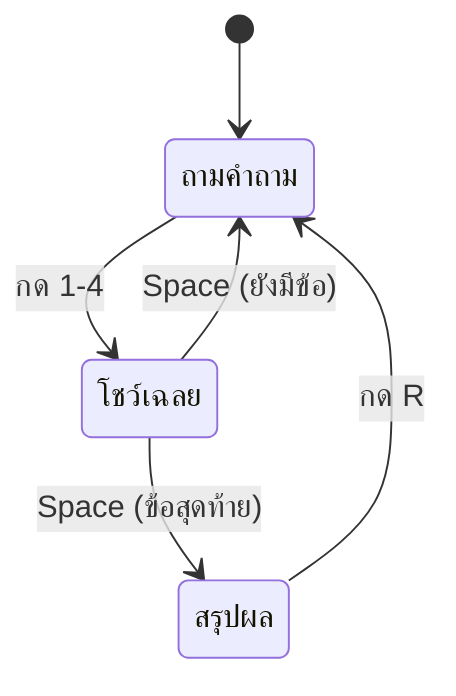

# 🎉 สรุป Week 6

## เช็คลิสต์

- [ ] ตอบถูก คะแนน +10 / ตอบผิด คะแนนเท่าเดิม
- [ ] ตอบแล้วหยุดโชว์เฉลย (ไม่ข้ามข้อทันที)
- [ ] กรอบเขียว = คำตอบที่ถูก
- [ ] กรอบแดง = ข้อที่เราเลือกผิด
- [ ] กด Space แล้วไปข้อถัดไป
- [ ] จบเกมเห็นการ์ดสรุป: คะแนน / ข้อที่ถูก / เหรียญ
- [ ] กด R เล่นใหม่ แล้วคะแนนกลับเป็น 0

---

## Concepts ที่ใช้ไป

| Concept | ใช้ที่ไหน |
|---------|-----------|
| `picked == answer` | เช็กคำตอบ |
| `score += 10` / `correct += 1` | สะสมคะแนนและตัวนับ |
| ตัวแปร state | `showing_result`, `finished` |
| เลือกสีด้วย `if/elif` | กรอบเขียว/แดง |
| `total / 2` | คิดเกณฑ์เหรียญ |
| รีเซ็ตตัวแปรทั้งชุด | ปุ่ม R เล่นใหม่ |

---

## แผนภาพ state

---

## บั๊กที่เจอบ่อย 🐞

| อาการ | สาเหตุ | แก้ยังไง |
|-------|--------|----------|
| กด 1 ครั้งข้าม 2 ข้อ | เช็กปุ่มทั้งใน `showing_result` และไม่ใช่ | ใช้ `if / elif / else` แยก state ให้ชัด |
| ค้างอยู่จอเฉลยตลอด | ลืม `showing_result = False` ตอนไปข้อใหม่ | เพิ่มบรรทัด |
| กด R แล้วคะแนนไม่รีเซ็ต | รีเซ็ตไม่ครบทุกตัวแปร | ไล่รีเซ็ตให้ครบ 6 ตัว |
| คะแนนเป็น 0 ตลอด | `score = 0` อยู่ในลูป | ย้ายออกไปนอกลูป |
| ตอบถูกแต่กรอบไม่เขียว | เทียบ `i` แทน `i + 1` | ข้อที่ 1 คือ index 0 |

---

## ต่อยอดได้

- ตอบผิดหักคะแนน `score -= 5`
- ทำ "คอมโบ": ตอบถูกติดกัน 3 ข้อ ได้โบนัส
- โชว์คำอธิบายเฉลยเพิ่มในแต่ละข้อ (เพิ่มช่องที่ 4 ใน list)

> Week 7 เราจะเพิ่ม **ตัวจับเวลา** — ตอบช้าเกิน 10 วินาที ถือว่าผิด! ⏱️

## เฉลยอยู่ที่ `quiz.py` 🗒️
