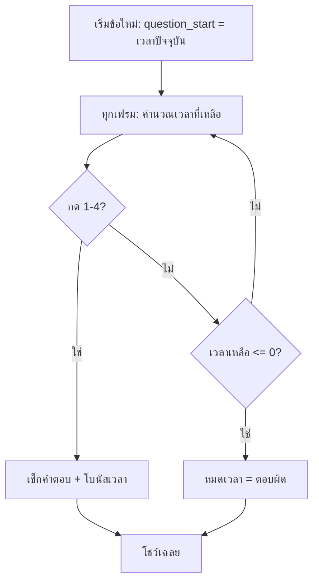

# Week 7 — Timed Game ⏱️

## วันนี้จะสร้างอะไร

Quiz Arena ที่ **จับเวลา 10 วินาทีต่อข้อ** — ตอบไม่ทัน = ผิดทันที!

```text
┌──────────────────────────────────────┐
│  QUIZ ARENA              คะแนน 20    │
│  ข้อ 2/5                             │
│  ███████████████░░░░░░░░   7.2 วิ     │  ← แถบเวลาลดลงเรื่อยๆ
│                                      │
│   สีของท้องฟ้าตอนกลางวัน?             │
│   1) แดง   2) ฟ้า   3) เขียว  4) ดำ  │
└──────────────────────────────────────┘

หมดเวลา → "หมดเวลา! คำตอบคือข้อ 2"
```

---

## Recap จาก Week 6

| ตัวแปร | หน้าที่ |
|--------|---------|
| `showing_result` | กำลังโชว์เฉลย |
| `finished` | จบเกม |
| `score` / `correct` | คะแนน / ข้อที่ถูก |

---

## ของใหม่วันนี้

| ของใหม่ | ทำอะไร |
|---------|--------|
| `pygame.time.get_ticks()` | ขอเวลาปัจจุบัน (มิลลิวินาที) |
| จำเวลาเริ่มข้อ | `question_start` |
| คำนวณเวลาที่เหลือ | `TIME_LIMIT - ผ่านไปกี่วิ` |
| แถบเวลา | `pygame.draw.rect` ที่ความกว้างเปลี่ยนได้ |
| โบนัสความเร็ว | ตอบไวได้คะแนนเยอะ |

---

## Flowchart



---

## ไฟล์วันนี้

```
002_ticks.py      → รู้จัก get_ticks() + นาฬิกาบนจอ
003_countdown.py  → นับถอยหลัง + แถบเวลา
004_timeup.py     → หมดเวลา = ผิด + โบนัสความเร็ว
quiz.py           → เฉลย
```

> เริ่มจาก `quiz.py` ของ Week 6
