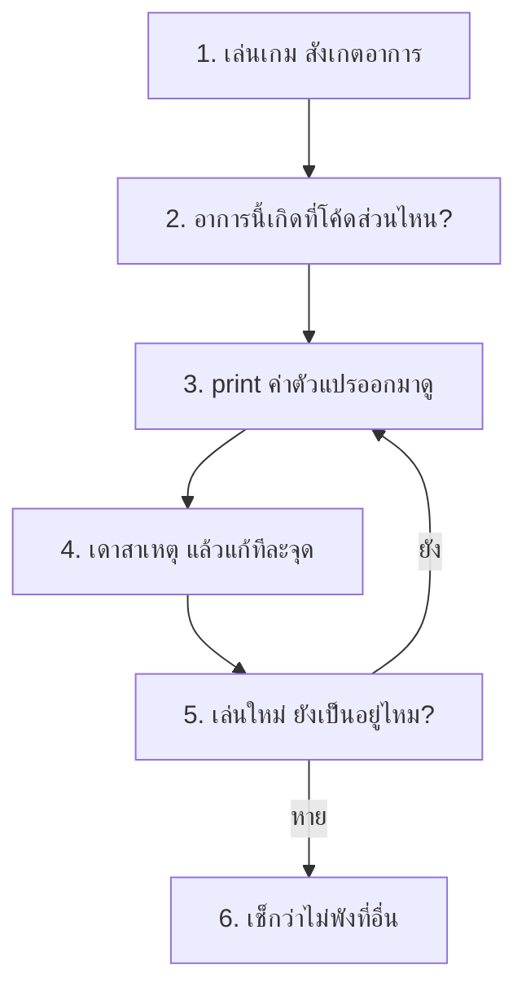

# Week 8 — Review & Improve 🐞🔧

## วันนี้จะทำอะไร

1. **ล่าบั๊ก** — เปิด `buggy.py` ที่มีบั๊กซ่อนอยู่ 4 ตัว หาให้เจอและแก้
2. **ปรับปรุงเกม** — เพิ่มหน้าเริ่มเกม, สลับคำถาม, สถิติสูงสุด
3. ได้ **Quiz Arena v1.0** ฉบับสมบูรณ์ปิดเดือน 2

---

## ทำไมต้องเรียน debug?

> โปรแกรมเมอร์ใช้เวลา **แก้บั๊กมากกว่าเขียนโค้ดใหม่**
> ทักษะนี้สำคัญกว่าการจำคำสั่งเยอะมาก

---

## วิธีล่าบั๊กแบบมืออาชีพ 🔍



**เครื่องมือที่ดีที่สุดคือ `print()`**

```python
print("DEBUG index =", index, " score =", score, " picked =", picked)
```

> วางไว้ในจุดที่สงสัย เล่นดู แล้วอ่านค่าที่ออกมา — ลบทิ้งเมื่อแก้เสร็จ

---

## อ่าน Error ให้เป็น 📕

```text
Traceback (most recent call last):
  File "buggy.py", line 88, in <module>
    q = questions[index]
        ~~~~~~~~~^^^^^^^
IndexError: list index out of range
```

| อ่านตรงไหน | บอกอะไร |
|------------|---------|
| บรรทัดล่างสุด | **ชนิดของปัญหา** (IndexError) |
| `line 88` | บรรทัดที่พัง |
| `q = questions[index]` | โค้ดที่พัง |

> อ่าน **จากล่างขึ้นบน** เสมอ

---

## ไฟล์วันนี้

```
buggy.py        → เกมที่มีบั๊ก 4 ตัว (ให้เด็กแก้)
002_bugs.md     → ใบงานล่าบั๊ก (อาการที่ต้องเจอ)
003_fix.md      → เฉลยบั๊ก
004_improve.md  → เพิ่มหน้าเริ่มเกม + สลับคำถาม + สถิติ
quiz.py         → Quiz Arena v1.0 (เฉลยสมบูรณ์)
```
