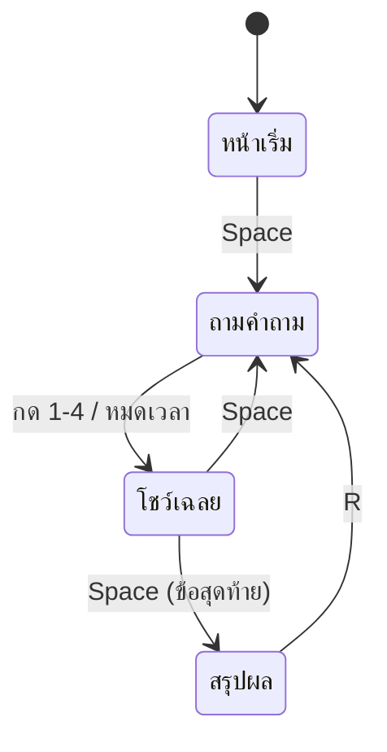

# 🎉 สรุป Week 8 + จบเดือน 2

## เช็คลิสต์

- [ ] แก้บั๊กใน `buggy.py` ครบ 4 ตัว
- [ ] มีหน้าเริ่มเกม กด Space เพื่อเริ่ม
- [ ] คำถามสลับลำดับทุกรอบ
- [ ] จบเกมโชว์คะแนน + เหรียญ + สถิติสูงสุด
- [ ] กด R เล่นใหม่ได้ สถิติสูงสุดไม่หาย
- [ ] กด Esc ออกได้จากทุกหน้าจอ

---

## Quiz Arena มีทั้งหมด 4 state

> เกมใหญ่ๆ ทุกเกมสร้างจากแนวคิด state แบบนี้ทั้งนั้น

---

## Concepts ทั้งเดือน 2

| Concept | สัปดาห์ |
|---------|---------|
| หน้าต่าง Pygame + game loop | 5 |
| ฟอนต์ไทย + `render` / `blit` | 5 |
| `list` ซ้อน `list` เก็บคำถาม | 5 |
| `KEYDOWN` รับปุ่ม | 5 |
| เช็กคำตอบ + คะแนน | 6 |
| state (`showing_result`, `finished`) | 6 |
| สีตามเงื่อนไข (feedback) | 6 |
| `get_ticks()` + นับถอยหลัง | 7 |
| แถบเวลา / แถบความคืบหน้า | 7-8 |
| โบนัสความเร็ว | 7 |
| debug ด้วย `print` + อ่าน Traceback | 8 |
| `random.shuffle` | 8 |
| high score | 8 |

---

## บั๊กคลาสสิก 5 อันดับที่ต้องจำ 🐞

1. ตัวแปรสะสมอยู่ในลูป → ค่าถูกล้างตลอด
2. `>` แทน `>=` → off-by-one → IndexError
3. ลืมรีเซ็ต state → ค้างหน้าจอเดิม
4. เทียบผิด index (`[1]` แทน `[2]`)
5. ลืม `pygame.display.flip()` → วาดแล้วไม่ขึ้นจอ

---

## ต่อยอดได้

- แยกคำถามเป็นหมวด (คณิต / วิทย์ / อังกฤษ) แล้วให้เลือกก่อนเล่น
- เพิ่มระบบชีวิต 3 ดวง ตอบผิดเสีย 1 ดวง
- โหมด 2 คน สลับกันตอบ (เจอใน **เดือน 4** — Turn-Based!)
- บันทึกสถิติลงไฟล์ (เจอใน **เดือน 5** — Save/Load 💾)

---

## 🎓 จบเดือน 2 แล้ว!

เดือนหน้าคือ **Word Hunter** 🔤 — เกมทายคำที่ต้องใช้ตัวอักษร, list และเหตุการณ์สุ่ม
เตรียมพบกับการทำงานกับ **string** ของจริง!

## เฉลยอยู่ที่ `quiz.py` 🗒️
