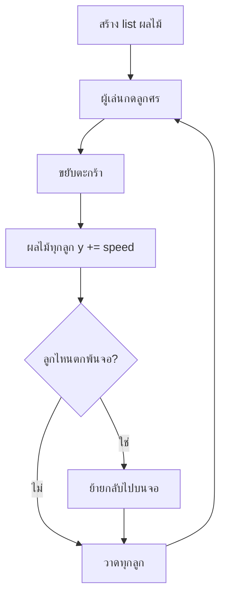

# Week 10 — Lists in Games 🧺 (Fruit Collector #1)

## วันนี้จะสร้างอะไร

เริ่มสร้าง **Fruit Collector** — เกมตะกร้ารับผลไม้ที่หล่นลงมาจากด้านบน

```text
┌──────────────────────────────────────┐
│    🍎        🍊                      │
│                      🍎              │
│         🍊                           │
│                                      │
│              🍎                      │
│                                      │
│  ────────   ▄▄▄▄▄▄   ────────        │  ← ตะกร้า เลื่อนซ้าย-ขวาด้วยลูกศร
└──────────────────────────────────────┘
```

> จำเกม Fruit Collector ที่เคยเล่นกันไหม? เวอร์ชันนั้นผลไม้อยู่นิ่งๆ ให้เดินไปชน
> **เวอร์ชันนี้ผลไม้จะหล่นลงมา** ต้องรีบวิ่งไปรับ — สนุกกว่าเยอะ 🎯

---

## ทำไมเกมนี้ถึงเหมาะกับ "Lists in Games"

ผลไม้บนจอมี **หลายลูกพร้อมกัน** ถ้าใช้ตัวแปรแยกกันจะเป็นแบบนี้

```python
fruit1_x = 100 ;  fruit1_y = 0
fruit2_x = 250 ;  fruit2_y = 80
fruit3_x = 400 ;  fruit3_y = 40
...
```

อยากได้ 20 ลูก = เขียน 40 ตัวแปร 😱

**list แก้ปัญหานี้ได้ในบรรทัดเดียว**

```python
fruits = [[100, 0], [250, 80], [400, 40]]
```

---

## Recap จากเดือนที่แล้ว

| โค้ด | ความหมาย |
|------|----------|
| `while running:` | game loop |
| `pygame.draw.rect()` | วาดสี่เหลี่ยม |
| `pygame.key.get_pressed()` | เช็กปุ่มที่กดค้าง |
| `for i in range(4):` | วนตามจำนวนรอบ |

---

## ของใหม่วันนี้

| ของใหม่ | ทำอะไร |
|---------|--------|
| `list` ของ `list` | เก็บผลไม้หลายลูก `[[x, y], [x, y], ...]` |
| `for fruit in fruits:` | วนผลไม้ **ทุกลูก** ที่มีอยู่ |
| `fruit[0]` / `fruit[1]` | หยิบ x และ y ของผลไม้ลูกนั้น |
| `fruits.append([x, y])` | เพิ่มผลไม้ลูกใหม่ |
| `pygame.key.get_pressed()` | ขยับตะกร้าแบบกดค้างได้ |

---

## Flowchart



---

## ไฟล์วันนี้

```
002_basket.py     → หน้าต่าง + ตะกร้าเลื่อนได้
003_fruit_list.py → list ผลไม้ + วาดทุกลูกด้วย for
004_falling.py    → ผลไม้หล่นลงมา + วนกลับขึ้นบน
game.py           → เฉลย
```

> เด็กสร้างไฟล์ `fruit.py` ของตัวเอง
