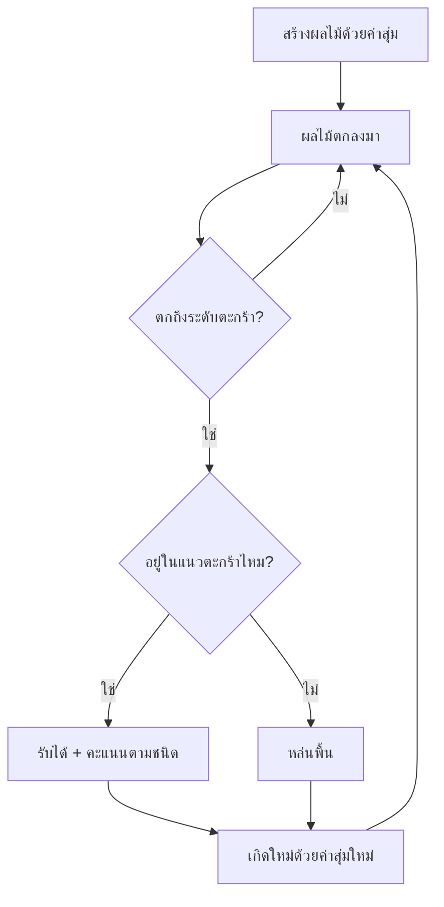

# Week 11 — Random Events 🎲 (Fruit Collector #2)

## วันนี้จะสร้างอะไร

ทำให้ Fruit Collector **เล่นได้จริง** — รับผลไม้ได้ มีคะแนน และไม่ซ้ำเดิมสักรอบ

```text
┌──────────────────────────────────────┐
│  คะแนน 34                            │
│         🍊+2                         │
│                    💣                │  ← ระเบิด! รับแล้วเสียคะแนน
│   🍎+1                               │
│              🍉+3                    │
│                                      │
│         ▄▄▄▄▄▄                       │
└──────────────────────────────────────┘
```

---

## ปัญหาของ Week 10

ผลไม้เกิดที่ตำแหน่งเดิมทุกครั้ง เล่น 2 รอบก็จำได้หมดแล้ว → **น่าเบื่อ**

> เกมที่ดีต้อง **คาดเดาไม่ได้** ความสุ่มคือหัวใจของการเล่นซ้ำ 🎲

---

## Recap

| โค้ด | ความหมาย |
|------|----------|
| `fruits = [[x, y], ...]` | list ผลไม้ |
| `for fruit in fruits:` | วนทุกลูก |
| `fruit[1] = fruit[1] + 3` | ทำให้ตก |

---

## ของใหม่วันนี้

| ของใหม่ | ทำอะไร |
|---------|--------|
| `random.randint(a, b)` | สุ่มตำแหน่ง x และความเร็ว |
| `random.choice(list)` | สุ่มชนิดผลไม้ |
| การชนแบบสี่เหลี่ยม | เช็กว่าผลไม้ตกลงตะกร้าไหม |
| ผลไม้เก็บ 4 ค่า | `[x, y, speed, type]` |
| ระเบิด 💣 | เหตุการณ์ที่ทำให้เสียคะแนน |

---

## Flowchart



---

## ไฟล์วันนี้

```
002_random_spawn.py → สุ่มตำแหน่งและความเร็ว
003_catch.py        → รับผลไม้ได้ + คะแนน
004_types.py        → ผลไม้ 3 ชนิด + ระเบิด
game.py             → เฉลย
```

> เริ่มจาก `game.py` ของ Week 10
