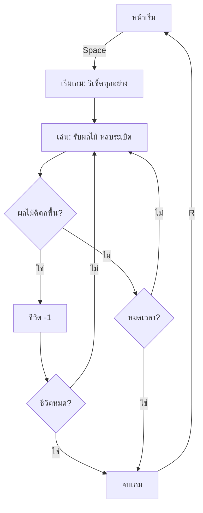

# Week 12 — Mini Game 🏆 (Fruit Collector #3 — ฉบับสมบูรณ์)

## วันนี้จะสร้างอะไร

ปิดเดือน 3 ด้วย **Fruit Collector v1.0** — เกมที่มีจุดเริ่ม มีจุดจบ และอยากเล่นซ้ำ

```text
┌──────────────────────────────────────┐
│ คะแนน 42      ♥ ♥ ♡      เวลา 23 วิ  │
│ ████████████████░░░░░░░              │
│        🍊+2                          │
│                  💣                  │
│   🍎+1                               │
│              ▄▄▄▄▄▄                  │
└──────────────────────────────────────┘

        จบเกมแล้ว →  คะแนน 42
                     สถิติสูงสุด 58
                     กด R เล่นใหม่
```

---

## เกมที่ "สมบูรณ์" ต้องมีอะไรบ้าง

| องค์ประกอบ | ทำไมต้องมี |
|------------|-----------|
| **จุดเริ่ม** | ผู้เล่นพร้อมก่อนค่อยเริ่ม ไม่ใช่โดนโยนเข้าเกมทันที |
| **เงื่อนไขแพ้** | ถ้าแพ้ไม่ได้ ก็ไม่ต้องตั้งใจเล่น |
| **เวลาจำกัด** | สร้างความกดดัน ทำให้ตื่นเต้น |
| **สถิติสูงสุด** | เหตุผลที่จะเล่นซ้ำ |
| **เริ่มใหม่ได้** | แพ้แล้วต้องกดเล่นต่อได้ทันที |

> 3 สัปดาห์ที่ผ่านมาเราสร้าง **ของเล่น** — วันนี้เปลี่ยนมันให้เป็น **เกม** 🎮

---

## Recap เดือน 3

| สัปดาห์ | ได้อะไรมา |
|---------|-----------|
| 9 | string logic — ทายตัวอักษรในคำ |
| 10 | `list` เก็บผลไม้หลายลูก + `for` วาดทุกลูก |
| 11 | `random` สุ่มตำแหน่ง/ชนิด + การชน + ตารางข้อมูล |

---

## ของใหม่วันนี้

| ของใหม่ | ทำอะไร |
|---------|--------|
| ระบบชีวิต | ผลไม้ดีตกพื้น = เสีย 1 ดวง |
| `pygame.time.get_ticks()` | นับเวลาถอยหลัง (ทบทวนจาก Week 7) |
| state ของเกม | `menu` → `playing` → `gameover` |
| `best` | สถิติสูงสุดข้ามรอบ |

---

## Flowchart



---

## ไฟล์วันนี้

```
002_lives.py  → ระบบชีวิต 3 ดวง
003_timer.py  → นับถอยหลัง 45 วินาที
004_menu.py   → หน้าเริ่ม + จอจบเกม + สถิติสูงสุด
game.py       → Fruit Collector v1.0 (เฉลย)
```

> เริ่มจาก `game.py` ของ Week 11
