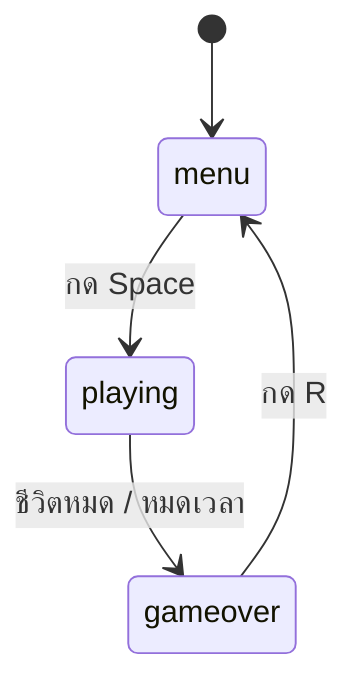

# 3) หน้าเริ่ม จอจบเกม และสถิติสูงสุด

## เป้าหมาย
ทำให้เกมมี 3 หน้าจอ และเล่นซ้ำได้ไม่ต้องปิดโปรแกรม

---

## แนวคิด — 3 state ของเกม

```python
state = "menu"        # "menu" / "playing" / "gameover"
```



**ส่วน INPUT**

```python
if event.type == pygame.KEYDOWN:
    if state == "menu" and event.key == pygame.K_SPACE:
        state = "playing"
        ...รีเซ็ตทุกอย่าง...
    elif state == "gameover" and event.key == pygame.K_r:
        state = "menu"
```

**ส่วน OUTPUT**

```python
if state == "menu":
    ...วาดหน้าเริ่ม...
elif state == "gameover":
    ...วาดจอสรุป...
else:
    ...วาดเกม...
```

> ใช้ข้อความ (`"menu"`) แทน `True/False` เพราะมีมากกว่า 2 สถานะ
> และอ่านโค้ดแล้วเข้าใจทันทีว่าอยู่หน้าไหน

---

## แนวคิด — รีเซ็ตให้ครบทุกตัว

ตอนเริ่มเกมใหม่ต้องล้างค่าทั้งหมด ลืมตัวไหนก็เป็นบั๊ก

```python
score = 0
lives = 3
time_left = TIME_LIMIT
start_time = pygame.time.get_ticks()     # ← ลืมบ่อยที่สุด!
fruits = []
for i in range(8):
    fruits.append([...ค่าสุ่ม...])
```

| ลืมรีเซ็ต | อาการ |
|-----------|-------|
| `score` | คะแนนสะสมข้ามรอบ |
| `lives` | เริ่มมาก็แพ้เลย |
| `start_time` | หมดเวลาทันทีที่กดเริ่ม |
| `fruits` | ผลไม้ค้างอยู่กลางจอจากรอบก่อน |

---

## แนวคิด — สถิติสูงสุด

```python
best = 0            # ← อยู่นอกการรีเซ็ต ไม่งั้นสถิติหาย

# ตอนจบเกม
if score > best:
    best = score
```

> ต้องอัปเดตตอน **เพิ่งจบ** ครั้งเดียว ไม่ใช่ทุกเฟรม
> (เทคนิค guard เดียวกับ Quiz Arena)

---

## 📝 แก้ `fruit.py`

1. เปลี่ยน `game_over` เป็น `state` ที่เก็บข้อความ 3 แบบ
2. เพิ่ม `best = 0` ไว้บนสุด
3. เขียนหน้าเริ่มและจอสรุป
4. ปุ่ม Space เริ่มเกม / ปุ่ม R กลับเมนู / Esc ออก

---

> รันดู — เริ่มที่เมนู เล่นจนแพ้ ดูสถิติ กด R กลับเมนู แล้วเล่นใหม่ได้ ✅
> เล่นให้ได้คะแนนสูงกว่าเดิม สถิติต้องอัปเดต
