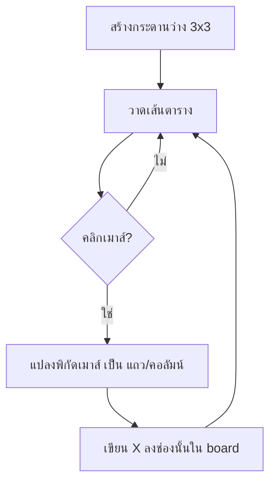

# Week 13 — Functions in Games 🔧 (Tic-Tac-Toe #1)

## วันนี้จะสร้างอะไร

เริ่มเกม **Tic-Tac-Toe (XO)** — กระดาน 3×3 คลิกช่องไหนก็วางเครื่องหมายลงช่องนั้น

```text
        ┌─────┬─────┬─────┐
        │  X  │     │  X  │
        ├─────┼─────┼─────┤
        │     │  X  │     │
        ├─────┼─────┼─────┤
        │  X  │     │     │
        └─────┴─────┴─────┘
             คลิกเพื่อวาง
```

> เดือนที่แล้วเป็นเกม **คนเดียว ใช้รีเฟล็กซ์**
> เดือนนี้เป็นเกม **สองคน ใช้ความคิด** — คนละแนวไปเลย 🧠

---

## ปัญหาที่เจอตอนจบเดือน 3

เปิดไฟล์ `game.py` ของ Fruit Collector ดูสิ — **ยาวเกือบ 200 บรรทัด** และทุกอย่างกองรวมกันในลูปเดียว

```python
while running:
    for event in ...          # 30 บรรทัด
    if state == "playing":    # 40 บรรทัด
    screen.fill(...)          # 60 บรรทัด
```

อยากแก้แค่หน้าเมนู ต้องเลื่อนหาในกองโค้ด 200 บรรทัด 😵

> **`def` คือทางออก** — เหมือนที่ `while` ช่วยเรื่องการทำซ้ำ
> `def` ช่วยเรื่อง **การแบ่งงานเป็นชิ้น** 🔧

---

## ของใหม่วันนี้

| ของใหม่ | ทำอะไร |
|---------|--------|
| `def ชื่อ():` | สร้างฟังก์ชัน = ตั้งชื่อให้โค้ดก้อนหนึ่ง |
| `ชื่อ()` | เรียกใช้ฟังก์ชัน |
| `def ชื่อ(a, b):` | ฟังก์ชันที่รับค่าเข้าไปทำงาน |
| `MOUSEBUTTONDOWN` | จับการคลิกเมาส์ |
| `pygame.mouse.get_pos()` | รู้ว่าคลิกตรงไหน |
| `board = [[...], [...], [...]]` | กระดาน 3×3 |

---

## Flowchart



---

## ไฟล์วันนี้

```
002_def.py      → รู้จัก def ด้วยของง่ายๆ ก่อน
003_board.py    → กระดาน 3x3 + วาดด้วยฟังก์ชัน
004_click.py    → คลิกวาง X ลงช่อง
game.py         → เฉลย
```

> เด็กสร้างไฟล์ `xo.py` ของตัวเอง
