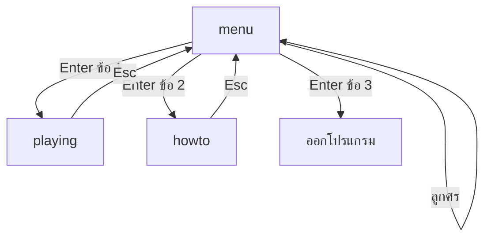

# Week 14 — Game Menu 📋 (Tic-Tac-Toe #2)

## วันนี้จะสร้างอะไร

เพิ่มระบบเมนูให้ XO — และทำให้เป็น **เมนูที่ก๊อปไปใช้กับเกมอื่นได้เลย**

```text
╔══════════════════════════════╗
║       TIC - TAC - TOE        ║
║                              ║
║     ▸ 1. เริ่มเกมใหม่          ║
║       2. วิธีเล่น             ║
║       3. ออกจากเกม            ║
║                              ║
║   ลูกศรขึ้น-ลง เลือก          ║
║   Enter ยืนยัน                ║
╚══════════════════════════════╝
```

---

## เมนูที่ดีต่างจากเมนูที่แย่ยังไง

| ❌ เมนูที่แย่ | ✅ เมนูที่ดี |
|--------------|-------------|
| กด Space อย่างเดียว เข้าเกมเลย | เลือกได้หลายอย่าง |
| ไม่รู้ว่าตอนนี้เลือกอะไรอยู่ | มีตัวชี้ `▸` บอกชัดเจน |
| ไม่มีวิธีเล่น | มีหน้าอธิบายกติกา |
| เขียนใหม่ทุกเกม | โครงเดียวใช้ได้ทุกเกม |

---

## Recap จาก Week 13

| โค้ด | ความหมาย |
|------|----------|
| `def draw_grid():` | ฟังก์ชันวาดเส้นตาราง |
| `cell_from_mouse(mx, my)` | แปลงพิกัดเมาส์เป็นช่อง |
| `board[r][c]` | ช่องในกระดาน |

---

## ของใหม่วันนี้

| ของใหม่ | ทำอะไร |
|---------|--------|
| `menu_items` (list) | รายการเมนู — เพิ่ม/ลดได้โดยไม่แก้ logic |
| `selected` | ตอนนี้ตัวชี้อยู่ที่ข้อไหน |
| `% len(...)` | เลื่อนตัวชี้แบบวนรอบ |
| `def reset_game():` | ฟังก์ชันล้างกระดาน ใช้ซ้ำได้ |
| state 3 แบบ | `menu` / `howto` / `playing` |

---

## Flowchart



---

## ไฟล์วันนี้

```
002_menu_list.py  → รายการเมนู + ตัวชี้เลื่อนได้
003_states.py     → สลับหน้า menu / howto / playing
004_reset.py      → ฟังก์ชันเริ่มเกมใหม่
game.py           → เฉลย
```
