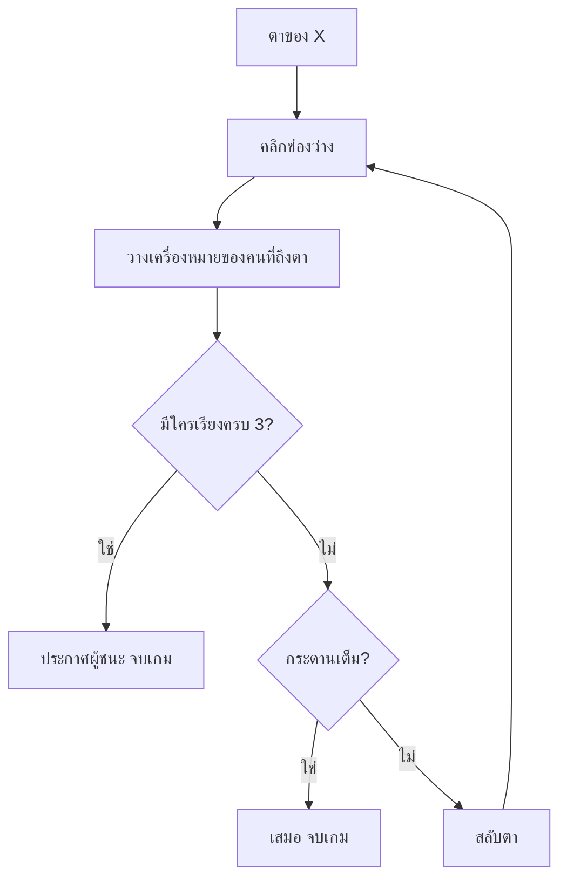

# Week 15 — Turn-Based Logic ⭕❌ (Tic-Tac-Toe #3)

## วันนี้จะสร้างอะไร

หัวใจของเดือนนี้ — **เกม 2 คนผลัดกันเล่น** และรู้ว่าใครชนะ

```text
        ตาของ ผู้เล่น 2 (O)

        ┌─────┬─────┬─────┐
        │  X  │  O  │  X  │
        ├─────┼─────┼─────┤
        │  O  │  X  │     │
        ├─────┼─────┼─────┤
        │     │     │  X  │   ← X เรียงแนวทแยงครบ!
        └─────┴─────┴─────┘

            ผู้เล่น 1 (X) ชนะ!
```

---

## ต่างจากเกมที่ผ่านมายังไง

| เกม | ผู้เล่น | ตัดสินแพ้ชนะจาก |
|-----|---------|------------------|
| Quiz Arena | 1 คน | คะแนนตัวเอง |
| Fruit Collector | 1 คน | เวลา/ชีวิตตัวเอง |
| **Tic-Tac-Toe** | **2 คน** | **ใครทำสำเร็จก่อน** |

> เกมผลัดตาต้องตอบ 2 คำถามให้ได้เสมอ
> **1) ตอนนี้ตาใคร** และ **2) จบหรือยัง** 🔄

---

## Recap

| โค้ด | ความหมาย |
|------|----------|
| `board[r][c]` | ช่องในกระดาน |
| `cell_from_mouse()` | แปลงพิกัดเมาส์เป็นช่อง |
| `reset_game()` | ล้างกระดาน |

---

## ของใหม่วันนี้

| ของใหม่ | ทำอะไร |
|---------|--------|
| `turn` | เก็บว่าตอนนี้ตาใคร |
| สลับตา | `if turn == "X": turn = "O"` |
| `def check_winner():` | ตรวจ 8 แนวว่ามีใครเรียงครบ |
| `def board_full():` | ตรวจว่าเสมอหรือยัง |
| `winner` | เก็บผลของเกม |

---

## 8 แนวที่ต้องตรวจ

```text
แนวนอน 3        แนวตั้ง 3        แนวทแยง 2
███              █ . .            █ . .
. . .            █ . .            . █ .
. . .            █ . .            . . █

. . .            . █ .            . . █
███              . █ .            . █ .
. . .            . █ .            █ . .

. . .            . . █
. . .            . . █
███              . . █
```

---

## Flowchart



---

## ไฟล์วันนี้

```
002_turn.py     → สลับตา X / O
003_winner.py   → ตรวจผู้ชนะ 8 แนว
004_draw.py     → ตรวจเสมอ + จอประกาศผล
game.py         → เฉลย
```
