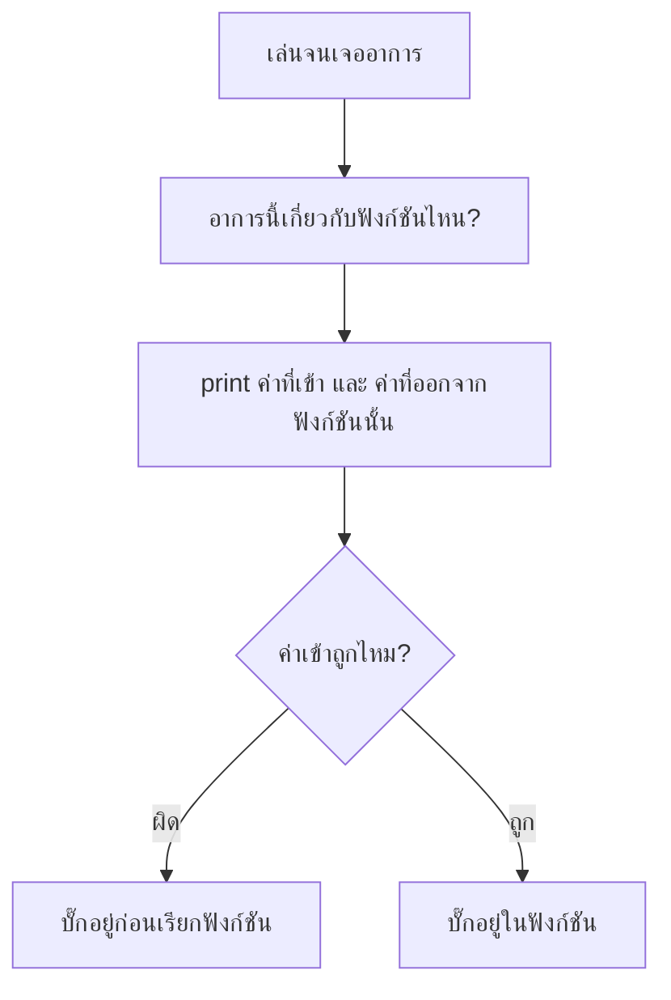

# Week 16 — Debugging Games 🐞 (Tic-Tac-Toe #4)

## วันนี้จะทำอะไร

1. **ล่าบั๊ก** — เปิด `buggy.py` ที่มีบั๊กซ่อนอยู่ 5 ตัว
2. **ขัดเกลา** — เพิ่มเส้นขีดทับช่องที่ชนะ และเอฟเฟกต์ช่องที่เมาส์ชี้
3. ได้ **Tic-Tac-Toe v1.1** ฉบับสมบูรณ์ปิดเดือน 4

---

## บั๊กในเกมผลัดตา ยากกว่าที่คิด

เกมเดือนก่อนๆ ถ้าพังจะเห็นทันที (ผลไม้ไม่ตก, คะแนนไม่ขึ้น)
แต่เกมนี้ **บั๊กหลายตัวไม่ทำให้ error เลย** แค่ผลลัพธ์ผิดเงียบๆ

| ประเภทบั๊ก | สังเกตยังไง |
|------------|-------------|
| 💥 พังทันที | มี error ขึ้นมา — ง่ายที่สุด |
| 🤫 **เงียบ** | ไม่ error แต่ผลผิด — ยากที่สุด |
| 🎲 นานๆ ที | เกิดเฉพาะบางสถานการณ์ — ต้องลองหลายรอบ |

> เดือนนี้เจอครบทั้ง 3 แบบ

---

## วิธีล่าบั๊กในเกมที่มีฟังก์ชัน



**เครื่องมือ** — `print` ในฟังก์ชัน

```python
def check_winner():
    print("DEBUG board =", board)
    ...
    print("DEBUG ผลตรวจ =", result)
```

> ข้อดีของการแบ่งโค้ดเป็นฟังก์ชันตั้งแต่ Week 13 คือ
> **แคบวงหาบั๊กได้เร็วขึ้นมาก** — ไม่ต้องไล่ทั้งไฟล์

---

## ไฟล์วันนี้

```
buggy.py        → เกมที่มีบั๊ก 5 ตัว (ให้เด็กแก้)
002_bugs.md     → ใบงานล่าบั๊ก
003_fix.md      → เฉลยบั๊ก
004_polish.md   → ขีดเส้นผู้ชนะ + ไฮไลต์ช่องที่ชี้
game.py         → Tic-Tac-Toe v1.1 (เฉลยสมบูรณ์)
```
