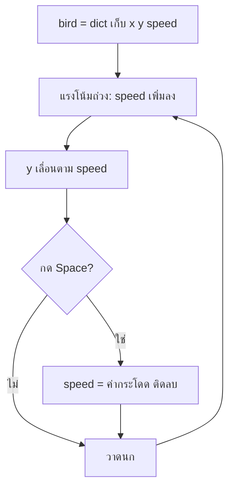

# Week 17 — Dictionaries 🐤 (Flappy Bird #1)

## วันนี้จะสร้างอะไร

กลับมาที่ **Flappy Bird** ที่เคยเล่นกัน — แต่คราวนี้เขียนใหม่ด้วย `dict`

```text
┌────────────────────────────────────────┐
│ คะแนน 7                     ดีที่สุด 12 │
│         ██                             │
│         ██              ██             │
│    🟡   ██              ██             │
│                         ██             │
│         ██                             │
│         ██              ██             │
└────────────────────────────────────────┘
       กด Space ให้นกกระโดด
```

---

## ปัญหาที่สะสมมา 4 เดือน

ดูตัวแปรของ Fruit Collector สิ

```python
basket_x = 345
basket_y = 530
speed = 7
score = 0
lives = 3
time_left = 45
```

ตัวแปรลอยๆ 6 ตัว ไม่มีอะไรบอกว่าอันไหนเป็นของใคร
พอเกมใหญ่ขึ้นเป็น 20-30 ตัว จะเริ่มงงว่า `speed` คือความเร็วของอะไร 🤯

---

## ของใหม่วันนี้ — `dict`

`dict` = กล่องที่เก็บข้อมูลเป็นคู่ **ชื่อ → ค่า**

```python
bird = {
    "x": 150,
    "y": 300,
    "speed": 0,
    "size": 18,
}
```

```python
print(bird["y"])        # 300
bird["y"] = 320         # แก้ค่า
```

| เทียบกับ list | `dict` |
|---------------|--------|
| `data[1]` — ต้องจำว่าช่อง 1 คืออะไร | `bird["y"]` — อ่านแล้วรู้เลย |
| เพิ่มช่องกลางแล้วเลขเลื่อนหมด | เพิ่มคีย์ใหม่ไม่กระทบของเดิม |
| เหมาะกับของหลายชิ้นแบบเดียวกัน | เหมาะกับของชิ้นเดียวที่มีหลายคุณสมบัติ |

> ผลไม้ 8 ลูก → ใช้ `list` ✅
> นก 1 ตัวที่มี x, y, ความเร็ว, ขนาด → ใช้ `dict` ✅

---

## ของใหม่วันนี้ (สรุป)

| ของใหม่ | ทำอะไร |
|---------|--------|
| `{"key": value}` | สร้าง dict |
| `d["key"]` | อ่าน/เขียนค่า |
| `d["new"] = x` | เพิ่มคีย์ใหม่ |
| `for key in d:` | วนทุกคีย์ |
| `list` ของ `dict` | ท่อทั้งหมดในเกม |

---

## Flowchart



---

## ไฟล์วันนี้

```
002_dict.py    → รู้จัก dict ด้วยของง่ายๆ
003_bird.py    → นก + แรงโน้มถ่วง + กระโดด
004_pipes.py   → ท่อเป็น list ของ dict
game.py        → เฉลย
```

> เด็กสร้างไฟล์ `flappy.py` ของตัวเอง
