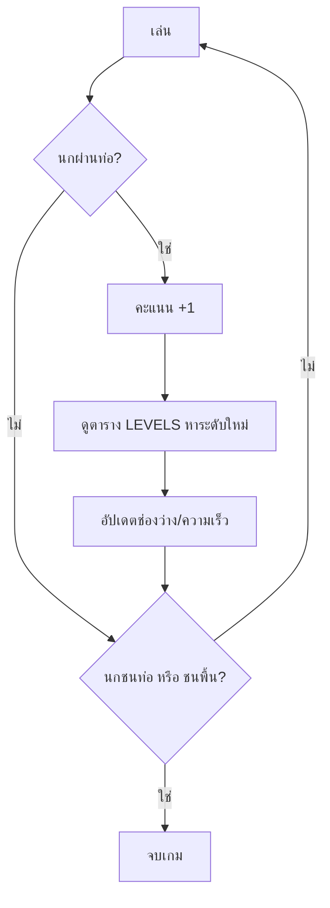

# Week 18 — Data-Driven Games 📊 (Flappy Bird #2)

## วันนี้จะสร้างอะไร

ทำให้ Flappy Bird **เล่นได้จริง** — ชนแล้วตาย มีคะแนน และ **ความยากคุมจากตารางข้อมูล**

```text
┌────────────────────────────────────────┐
│ คะแนน 12        ระดับ: ยาก             │
│      ██                    ██          │
│      ██                    ██          │
│  🟡                                    │
│                            ██          │
│      ██                    ██          │
└────────────────────────────────────────┘

ระดับ    ช่องว่าง   ความเร็ว   ทุกกี่คะแนน
ง่าย      200        2          0
ปกติ      160        3          5
ยาก       130        4          12
โหด       110        5          20
```

---

## "Data-Driven" คืออะไร

**แบบธรรมดา** — กติกาฝังอยู่ในโค้ด

```python
if score > 20:
    GAP = 110
    SPEED = 5
elif score > 12:
    GAP = 130
    SPEED = 4
elif score > 5:
    GAP = 160
    SPEED = 3
```

อยากเพิ่มระดับใหม่ = ไปแทรก `elif` กลางโค้ด เสี่ยงพัง 😰

**แบบ Data-Driven** — กติกาอยู่ในตาราง

```python
LEVELS = [
    {"name": "ง่าย", "gap": 200, "speed": 2, "at": 0},
    {"name": "ปกติ", "gap": 160, "speed": 3, "at": 5},
    {"name": "ยาก", "gap": 130, "speed": 4, "at": 12},
    {"name": "โหด", "gap": 110, "speed": 5, "at": 20},
]
```

อยากเพิ่มระดับ = **เพิ่ม 1 บรรทัดในตาราง** โค้ดไม่ต้องแตะเลย ✅

> ครูปรับความยากให้เหมาะกับเด็กแต่ละห้องได้ โดยไม่ต้องเข้าใจโค้ดทั้งไฟล์
> เกมมือถือที่เล่นกันทุกวันนี้ทำแบบนี้ทั้งนั้น 📱

---

## Recap

| โค้ด | ความหมาย |
|------|----------|
| `bird["y"]` | ตำแหน่งนก |
| `pipes` | list ของ dict |
| `pipe["scored"]` | ท่อนี้นับคะแนนไปหรือยัง |

---

## ของใหม่วันนี้

| ของใหม่ | ทำอะไร |
|---------|--------|
| `LEVELS` | ตารางความยาก (list ของ dict) |
| การชนสี่เหลี่ยม | นกชนท่อไหม |
| `pipe["scored"]` | กันนับคะแนนซ้ำ |
| เลือกระดับจากคะแนน | ยิ่งเก่งยิ่งยาก |

---

## Flowchart



---

## ไฟล์วันนี้

```
002_collision.py → ชนท่อแล้วตาย
003_score.py     → ผ่านท่อได้คะแนน
004_levels.py    → ตารางความยาก
game.py          → เฉลย
```
