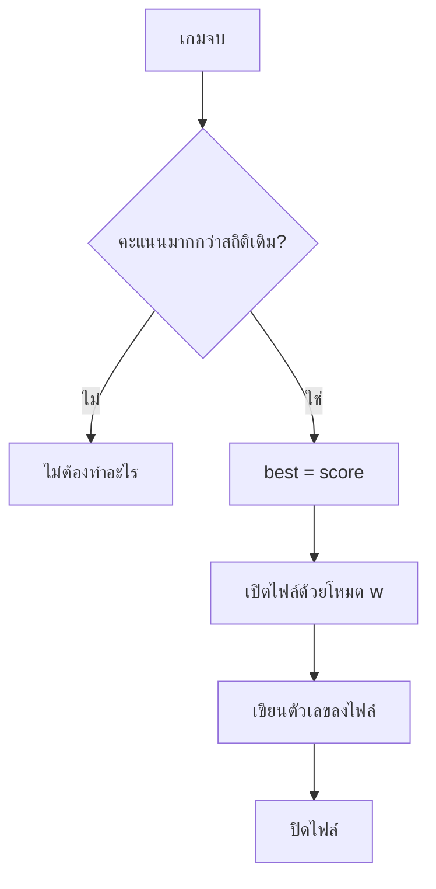

# Week 19 — Save Game Data 💾 (Flappy Bird #3)

## วันนี้จะสร้างอะไร

ทำให้สถิติ **ไม่หายตอนปิดเกม**

```text
เล่นรอบแรก   ได้ 14 คะแนน  →  บันทึกลงไฟล์
ปิดโปรแกรม
เปิดใหม่วันรุ่งขึ้น           →  ยังเห็น "ดีที่สุด 14" 🎉
```

---

## ปัญหาที่เจอมาตลอด 4 เดือน

ทุกเกมที่ทำมา สถิติสูงสุดอยู่ในตัวแปร

```python
best = 0
```

ตัวแปรอยู่ใน **หน่วยความจำ (RAM)** → ปิดโปรแกรม = หายหมด 😢

> ของที่ต้องอยู่ถาวรต้องเก็บใน **ไฟล์** บนดิสก์
> เกมทุกเกมในโลก ตั้งแต่ Minecraft ยัน ROV ก็ทำแบบนี้ 💾

---

## ของใหม่วันนี้

| ของใหม่ | ทำอะไร |
|---------|--------|
| `open(ชื่อไฟล์, "w")` | เปิดไฟล์เพื่อ **เขียน** |
| `f.write(ข้อความ)` | เขียนข้อความลงไฟล์ |
| `f.close()` | ปิดไฟล์ (สำคัญมาก!) |
| `with open(...) as f:` | เปิดแล้วปิดให้อัตโนมัติ |
| `str(ตัวเลข)` | แปลงเลขเป็นข้อความก่อนเขียน |

---

## ⚠️ ข้อควรรู้ก่อนเริ่ม

| โหมด | ความหมาย | ระวัง |
|------|-----------|-------|
| `"w"` | write — เขียนทับ | **ลบของเดิมทิ้งหมด** |
| `"a"` | append — เขียนต่อท้าย | ของเดิมยังอยู่ |
| `"r"` | read — อ่านอย่างเดียว | เขียนไม่ได้ |

> เปิดด้วย `"w"` แล้วไฟล์เดิมหายทันที แม้ยังไม่ได้เขียนอะไรเลย
> ระวังให้ดี — นี่คือวิธีทำข้อมูลหายที่พบบ่อยที่สุด 😱

---

## Flowchart



---

## ไฟล์วันนี้

```
002_write.py    → เขียนไฟล์ครั้งแรก
003_save.py     → บันทึกสถิติสูงสุด
004_history.py  → บันทึกประวัติทุกรอบ
game.py         → เฉลย
```

> เกมจะสร้างไฟล์ `flappy_save.txt` ไว้ในโฟลเดอร์เดียวกับโปรแกรม
