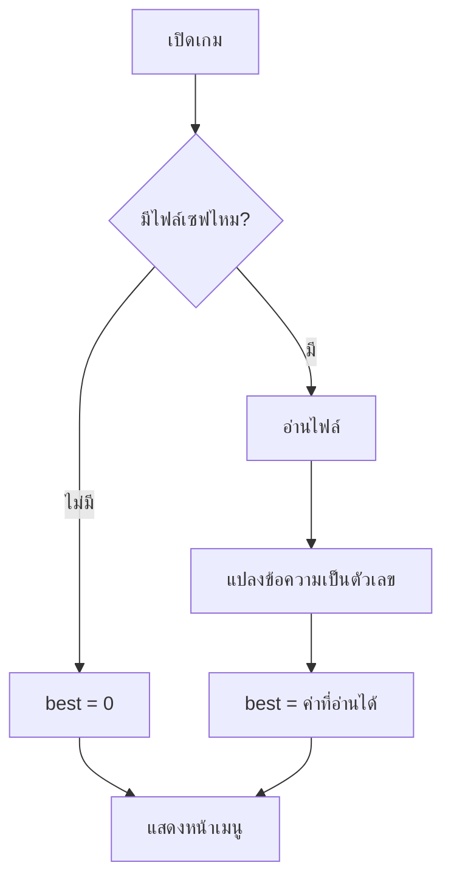

# Week 20 — Load Game Data 📂 (Flappy Bird #4 — ฉบับสมบูรณ์)

## วันนี้จะสร้างอะไร

อ่านข้อมูลที่เซฟไว้กลับมา แล้วปิดเดือน 5 ด้วย **Flappy Bird v1.0**

```text
╔════════════════════════════════════╗
║          FLAPPY BIRD v1.0          ║
║                                    ║
║     🟡                             ║
║                                    ║
║        กด Space เพื่อเริ่ม          ║
║                                    ║
║   สถิติสูงสุด : 21                 ║
║   เล่นไปแล้ว  : 34 รอบ             ║
║   คะแนนเฉลี่ย : 8.4                ║
╚════════════════════════════════════╝
```

> สัปดาห์ที่แล้วเรา **เขียน** ข้อมูลลงไฟล์
> สัปดาห์นี้เรา **อ่าน** มันกลับมาใช้ 📂

---

## ของใหม่วันนี้

| ของใหม่ | ทำอะไร |
|---------|--------|
| `open(ไฟล์, "r")` | เปิดไฟล์เพื่ออ่าน |
| `f.read()` | อ่านทั้งไฟล์เป็นข้อความก้อนเดียว |
| `f.readlines()` | อ่านเป็น list ทีละบรรทัด |
| `int(ข้อความ)` | แปลงข้อความกลับเป็นตัวเลข |
| `os.path.exists()` | เช็กว่ามีไฟล์ไหม |
| `line.strip()` | ตัด `\n` ท้ายบรรทัดทิ้ง |

---

## ⚠️ ปัญหาใหญ่ที่สุดของการอ่านไฟล์

**เปิดเกมครั้งแรก ยังไม่มีไฟล์เซฟ** → โปรแกรมพังทันที

```text
FileNotFoundError: [Errno 2] No such file or directory: 'flappy_save.txt'
```

ทุกเกมต้องรับมือกับกรณีนี้ให้ได้ ไม่งั้นเปิดครั้งแรกก็เล่นไม่ได้แล้ว 😱

**ทางแก้** — เช็กก่อนว่ามีไฟล์ไหม

```python
import os

if os.path.exists(SAVE_FILE):
    ...อ่านไฟล์...
else:
    best = 0            # ไม่มีไฟล์ = เริ่มจาก 0
```

---

## Flowchart



---

## ไฟล์วันนี้

```
002_read.py   → อ่านไฟล์ครั้งแรก
003_load.py   → โหลดสถิติตอนเปิดเกม
004_stats.py  → อ่านประวัติมาคำนวณสถิติ
game.py       → Flappy Bird v1.0 (เฉลย)
```
